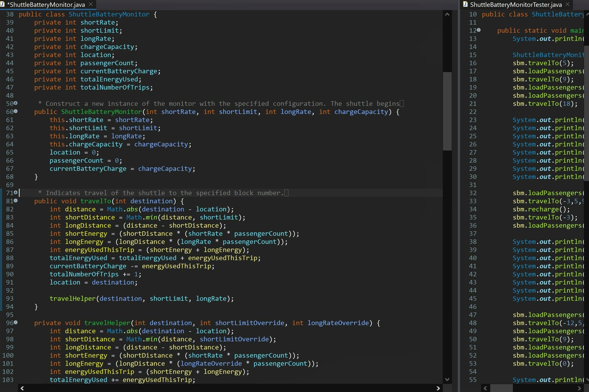

# 🔋 CS 5044 – P1: Shuttle Battery Monitor

---

## 🧠 What It Does

Simulates an electric shuttle's battery usage as it travels between blocks, tracking
location, passenger count, and energy usage. The shuttle uses energy at a normal rate for
short trips and a different rate for the portion of any trip beyond a configurable "short
trip" limit.

## 🎯 Why It Matters

First project with real internal state and multiple interacting methods, verified with an
informal `println`-based tester rather than a formal test framework.

---

## ✨ Features

- Track shuttle location and passenger count as it travels
- Calculate energy usage per trip, split between short-trip and long-trip rates
- Support one-off overrides of the short limit / long rate for individual trips
- Recharge the battery by returning to the origin (block zero)
- Report battery charge remaining (%), average energy usage per trip, and estimated trips
  remaining on current charge

---

## 🛠️ Requirements

- JDK 17+ (developed/tested with Java 17)
- IntelliJ IDEA (Community Edition works fine)

## ▶️ How to Run

1. Open IntelliJ IDEA
2. **File → Open**, select this project's folder (the one containing `src/`)
3. Click **Trust Project** if prompted
4. Let IntelliJ finish indexing (progress bar at the bottom)
5. In the Project panel: `src → edu.vt.cs5044 → ShuttleBatteryMonitorTester`
6. Right-click `ShuttleBatteryMonitorTester` → **Run**

---

## 🧪 Testing Approach

The assignment required exercising each method (including the constructor) at least three
times, beyond the sample tester provided. The tester covers six distinct scenarios, each
exercising the constructor, multiple `travelTo` calls (including the short-limit/long-rate
override variant), passenger loading, recharging, and all three reporting methods across
varied trip sequences.

---

## 💻 Setting This Up on Another PC

**Option 1 — Download ZIP**
1. On GitHub, go to this repo → green **Code** button → **Download ZIP**
2. Unzip it wherever you want
3. Open the folder in IntelliJ (`File → Open`) and follow "How to Run" above

**Option 2 — Git Clone**
1. Install Git: https://git-scm.com/downloads
2. `git clone https://github.com/yourusername/your-repo.git`
3. Open the cloned folder in IntelliJ and follow "How to Run" above

---

## 📝 Notes

- `.idea/` and `out/` folders are intentionally not included - these are IDE-specific/
  build files that regenerate automatically when you open the project fresh in IntelliJ.
