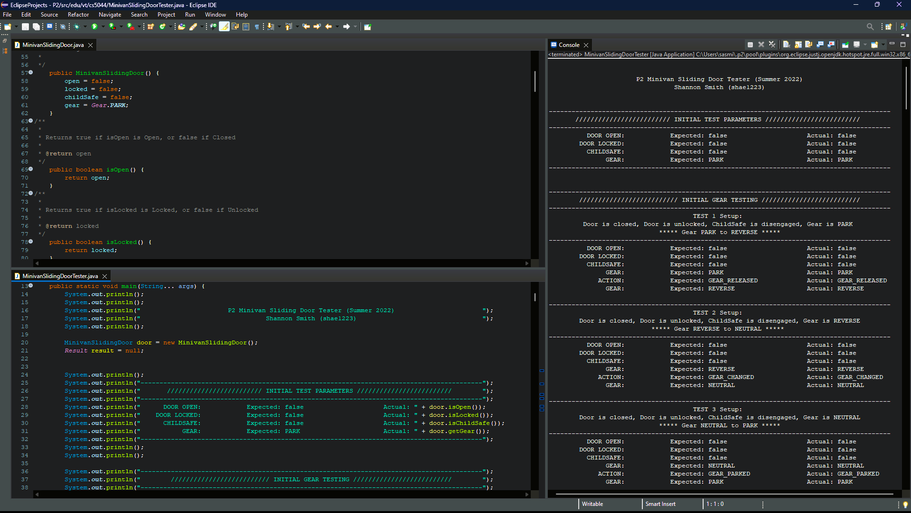
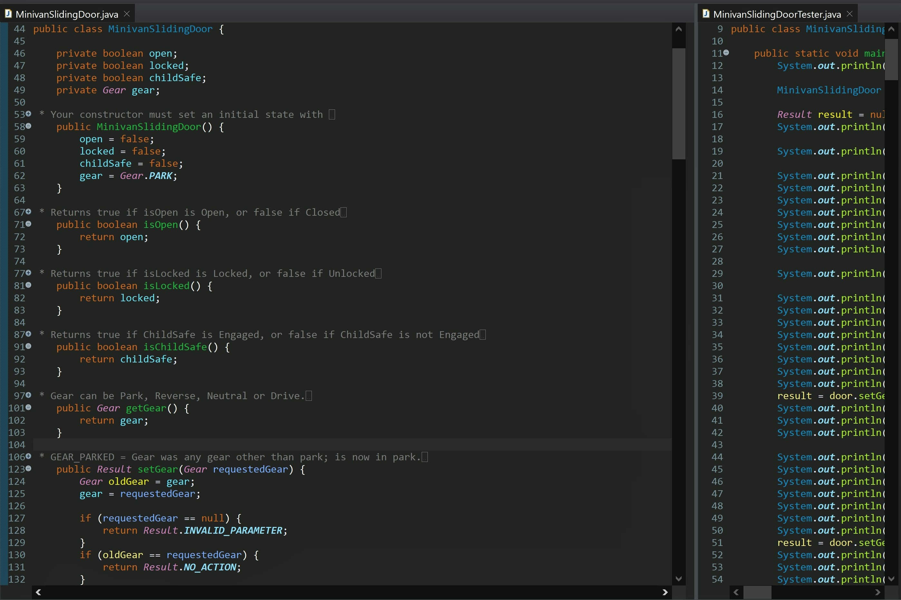

# 🚐 CS 5044 – P2: Minivan Sliding Door

---

## 🧠 What It Does

Simulates the control logic for a minivan's automatic sliding door, including door
open/close, lock/unlock, child-safety lock, and gear shift state - enforcing the safety
rules that govern when each action is allowed to succeed.

## 🎯 Why It Matters

Built under a deliberately restrictive constraint (no nested branches, no `&&`/`||`),
forcing precedence logic into a sequence of independent, individually readable
conditionals - closer to how detection/alert-priority rules often need to be both correct
and auditable.

---

## ✨ Features

- Track door open/closed, locked/unlocked, child-safe engaged/disengaged, and gear state
- Enforce safety rules for opening the door via dashboard button, outside handle, or
  inside handle (each has different requirements - e.g. the inside handle additionally
  respects child-safety)
- Support locking/unlocking and gear changes at any time
- Return a specific `Result` value for every action, following defined precedence rules
  when multiple conditions could apply (e.g. gear-not-in-park takes priority over
  door-locked)

## 🔒 Design Constraints

The assignment prohibited nested branches and the `&&`/`||` logical operators (only `!`
was allowed). This is why the precedence logic is implemented as a sequence of independent
`if` statements with early returns, each checking one condition, rather than combined
boolean expressions.

---

## 🛠️ Requirements

- JDK 17+ (developed/tested with Java 17)
- IntelliJ IDEA (Community Edition works fine)

## ▶️ How to Run

1. Open IntelliJ IDEA
2. **File → Open**, select this project's folder (the one containing `src/`)
3. Click **Trust Project** if prompted
4. Let IntelliJ finish indexing (progress bar at the bottom)
5. In the Project panel: `src → edu.vt.cs5044 → MinivanSlidingDoorTester`
6. Right-click `MinivanSlidingDoorTester` → **Run**

---

## 🧪 Testing Approach

The 38-scenario tester validates every `Result` value the class can return, and gives
particular attention to the precedence rules defined in `Result.java` - where multiple
refusal conditions could apply to the same request, but only one `Result` is correct.

Tests 24-37 systematically isolate each priority rule by holding two blocking conditions
satisfied and varying a third. For example, Test 24 proves that `OPEN_REFUSED_GEAR` takes
precedence over an already-open door's `NO_ACTION` - directly exercising the example given
in `Result.java`'s own javadoc comment. Tests 32, 33, 35, and 36 apply the same isolation
technique to the inside handle, confirming the correct precedence order among childsafe,
gear, and lock conditions. Test 38 extends this further, confirming that childsafe blocks
an inside-handle open request even on an already-open door, while leaving inside-handle
close requests unaffected - proving childsafe governs opening only, not closing.

---

## ✅ Expected Output

All test methods should pass (green checkmarks in IntelliJ's test runner panel, process
exits with code 0).

---

## 💻 Setting This Up on Another PC

**Option 1 — Download ZIP**
1. On GitHub, go to this repo → green **Code** button → **Download ZIP**
2. Unzip it wherever you want
3. Open the folder in IntelliJ (`File → Open`) and follow "How to Run" above

**Option 2 — Git Clone**
1. Install Git: https://git-scm.com/downloads
2. `git clone https://github.com/yourusername/your-repo.git`
3. Open the cloned folder in IntelliJ and follow "How to Run" above

---

## 📝 Notes

- `.idea/` and `out/` folders are intentionally not included - these regenerate
  automatically when you open the project fresh in IntelliJ.
- `Result.java`, `Direction.java`, and `Gear.java` were provided as-is by the course and
  were not modified.
