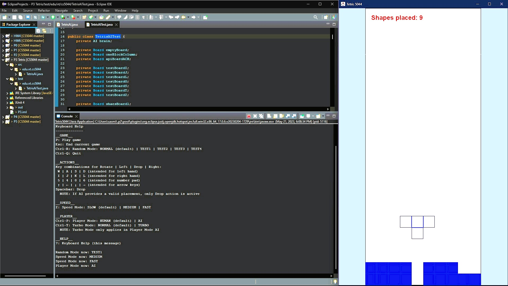
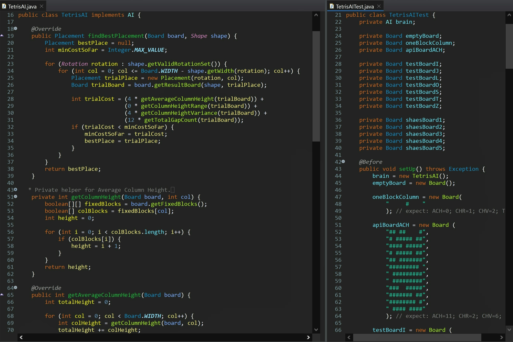

# 🎮 CS 5044 – P3: Tetris AI

---

## 🧠 What It Does

An AI that plays Tetris by evaluating every possible placement of a falling piece and
selecting the one that minimizes a weighted cost function based on board quality metrics.

## 🎯 Why It Matters

First project with formal JUnit tests and tuning against a numeric benchmark (average
pieces placed across test sequences) rather than a single fixed expected output - closer
to how a detection threshold gets tuned against real data.

---

## ✨ Features

- Evaluate all valid rotations and column positions for a given piece
- Score each resulting board state using four metrics:
  - **Average Column Height** - overall board height
  - **Column Height Range** - difference between tallest and shortest column
  - **Column Height Variance** - "bumpiness" between adjacent columns
  - **Total Gap Count** - buried empty cells beneath filled ones
- Select the placement with the lowest weighted combined cost

---

## 🛠️ Requirements

- JDK 17+ (developed/tested with Java 17)
- IntelliJ IDEA (Community Edition works fine)
- JUnit 4
- `tetris5044.jar` - Tetris game engine framework (`AI`, `Board`, `Placement`, `Rotation`,
  `Shape`)

## ▶️ How to Run

1. Open IntelliJ IDEA
2. **File → Open**, select this project's folder (the one containing `src/` and `test/`)
3. Click **Trust Project** if prompted
4. Let IntelliJ finish indexing (progress bar at the bottom)
5. If prompted with "Cannot resolve symbol 'junit'", click **Add 'JUnit4' to classpath**
   (Alt+Shift+Enter)
6. If the `test` folder shows a "located outside of the module source root" warning,
   right-click the `test` folder → **Mark Directory as → Test Sources Root**
7. If you see "Cannot resolve symbol" errors for `AI`, `Board`, `Placement`, `Rotation`,
   or `Shape`, add `tetris5044.jar` as a project library:
   - **File → Project Structure...** (Ctrl+Alt+Shift+S) → **Libraries** → **+** → **Java**
   - Select `tetris5044.jar` (in the project root), click **OK**, confirm the module
     checkbox, click **OK**, then **Apply** and **OK**
   - Optional: repeat with `tetris5044-api.jar` for hover-documentation. When prompted to
     "Choose Categories of Selected Files," select **JavaDocs** (not Classes)
8. In the Project panel: `test → edu.vt.cs5044 → TetrisAITest`
9. Right-click `TetrisAITest` → **Run 'TetrisAITest'**

### 🎮 Playing the Game

`tetris5044.jar` also includes a full playable Tetris game
(`edu.vt.cs5044.tetris.Tetris5044`) that your AI can be plugged into:

1. **Run → Edit Configurations...**
2. Click **+** → **Application**
3. In **Main class**, type `Tetris5044` and select `edu.vt.cs5044.tetris.Tetris5044`
4. Confirm the **Module** dropdown is set to this project, click **OK**
5. Run it via the green ▶ button

Once the game window opens: **P** to start, **A/D** to move, **W** to rotate,
**S**/spacebar to drop, **Ctrl-P** to toggle AI mode, **?** for the full control list.

---

## 🧪 Testing Approach

The assignment required at least 5 distinct, reasonably complex test boards shared across
the cost-method assertions, plus a separate set of boards for `findBestPlacement`, in
addition to simpler edge-case boards that don't count toward that minimum. The test suite
meets this with 5 custom boards used across `testACH`, `testCHR`, `testCHV`, and
`testTGC`, plus a full set of per-shape boards and simple edge cases used in `testBP`.

The weighting in `findBestPlacement` (4x Average Column Height, 0x Column Height Range, 4x
Column Height Variance, 12x Total Gap Count) was tuned within the assignment's specified
range of 0, 4, 8, or 12 per factor, determined by observing AI performance across the
game's built-in TEST sequences.

---

## ✅ Expected Output

All 5 test methods should pass (green checkmarks in IntelliJ's test runner panel, exit
code 0).

---

## 💻 Setting This Up on Another PC

**Option 1 — Download ZIP**
1. On GitHub, go to this repo → green **Code** button → **Download ZIP**
2. Unzip it wherever you want
3. Open the folder in IntelliJ (`File → Open`) and follow "How to Run" above

**Option 2 — Git Clone**
1. Install Git: https://git-scm.com/downloads
2. `git clone https://github.com/yourusername/your-repo.git`
3. Open the cloned folder in IntelliJ and follow "How to Run" above

---

## 📝 Notes

- `.idea/` and `out/` folders are intentionally not included.
- `tetris5044.jar` is a course-provided framework library containing the `AI`, `Board`,
  `Placement`, `Rotation`, and `Shape` classes/interfaces - included in this repo so the
  project runs without needing to track it down separately. `TetrisAI.java` is the
  implementation written for this assignment.
