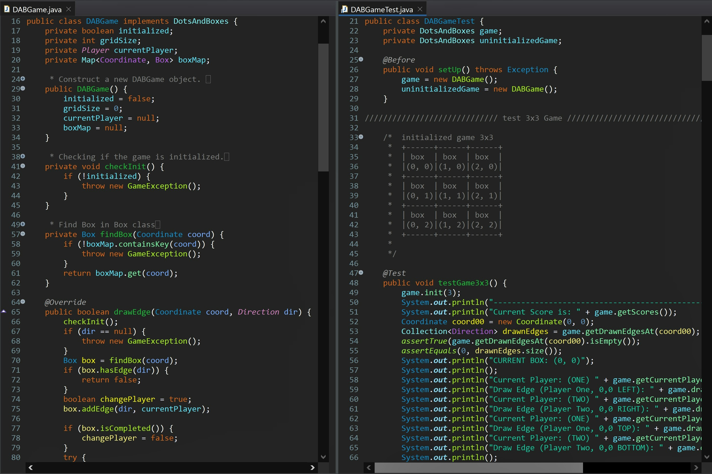

# 🎲 CS 5044 – P4: Dots and Boxes Game Engine

---

## 🧠 What It Does

Implements the game logic for Dots and Boxes: players take turns drawing edges on a grid,
claiming a box (and an extra turn) whenever their edge completes all four sides of it. The
game continues until every box is claimed, at which point the player with the most boxes
wins.

## 🎯 Why It Matters

Full JUnit branch coverage was a hard requirement, including every exception path (invalid
grid size, invalid coordinates, actions before initialization) - not just the happy path.

---

## ✨ Features

- Initialize a game grid of any size (minimum 2x2)
- Draw edges between grid points, with correct handling of shared edges between
  neighboring boxes
- Track box ownership, awarding an extra turn to whichever player completes a box (or two,
  if a single edge completes two boxes at once)
- Report current player, per-player scores, and game-over state
- Defensive checks: invalid grid sizes, invalid coordinates, null directions, and actions
  attempted before the game is initialized all throw `GameException`

---

## 🛠️ Requirements

- JDK 17+ (developed/tested with Java 17)
- IntelliJ IDEA (Community Edition works fine)
- JUnit 4
- `dab5044.jar` - course-provided framework library (included in this repo)

## ▶️ How to Run

1. Open IntelliJ IDEA
2. **File → Open**, select this project's folder (the one containing `src/` and `test/`)
3. Click **Trust Project** if prompted
4. Let IntelliJ finish indexing (progress bar at the bottom)
5. If prompted with "Cannot resolve symbol 'junit'", click **Add 'JUnit4' to classpath**
   (Alt+Shift+Enter)
6. If the `test` folder shows a "located outside of the module source root" warning,
   right-click the `test` folder → **Mark Directory as → Test Sources Root**
7. If you see "Cannot resolve symbol" errors for `Player`, `Direction`, `Coordinate`,
   `DotsAndBoxes`, or `GameException` - these come from the course-provided `dab5044.jar`
   framework library, included in this repo's project root. Full steps below.

### 📦 Adding dab5044.jar to the Project in IntelliJ

1. **File → Project Structure...** (Ctrl+Alt+Shift+S)
2. Click **Libraries** in the left sidebar
3. Click **+** → **Java**
4. Select `dab5044.jar` (in this project's root), click **OK**
5. Confirm the module checkbox is selected, click **OK**
6. **Apply**, then **OK** to close
7. Red underlines on `Player`, `Direction`, `Coordinate`, `DotsAndBoxes`, and
   `GameException` should now be gone

**Optional:** repeat with `dab5044-api.jar` for hover-documentation - not required to fix
the errors, purely a nice-to-have for reference while coding.

8. In the Project panel: `test → edu.vt.cs5044 → DABGameTest`
9. Right-click `DABGameTest` → **Run 'DABGameTest'**

---

## 🧪 Testing Approach

The assignment required full code coverage, not just correctness, so `DABGameTest` was
written to exercise every method and branch in `DABGame` and `Box` - including exception
paths (uninitialized game access, invalid grid sizes, invalid coordinates, null
directions) and the box-completion edge cases (a single edge completing one box, two boxes
at once, or none).

---

## ✅ Expected Output

All test methods should pass (green checkmarks in IntelliJ's test runner panel, process
exits with code 0). One test (`testGame3x3`) prints a full trace of a 3x3 game being played
move-by-move, ending with a final score and winner - this is expected console output, not
an error.

---

## 💻 Setting This Up on Another PC

**Option 1 — Download ZIP**
1. On GitHub, go to this repo → green **Code** button → **Download ZIP**
2. Unzip it wherever you want
3. Open the folder in IntelliJ (`File → Open`) and follow "How to Run" above

**Option 2 — Git Clone**
1. Install Git: https://git-scm.com/downloads
2. `git clone https://github.com/yourusername/your-repo.git`
3. Open the cloned folder in IntelliJ and follow "How to Run" above

---

## 📝 Notes

- `.idea/`, `out/`, `bin/`, `.settings/`, `.classpath`, and `.project` are intentionally
  not included - IDE-specific/build files or leftover Eclipse artifacts.
- `dab5044.jar` is a course-provided framework library, not something written for this
  assignment - included in the repo so the project runs out of the box.
- `Box.java`, `DABGame.java`, and `DABGameTest.java` are all the implementation and test
  suite written for this assignment.
