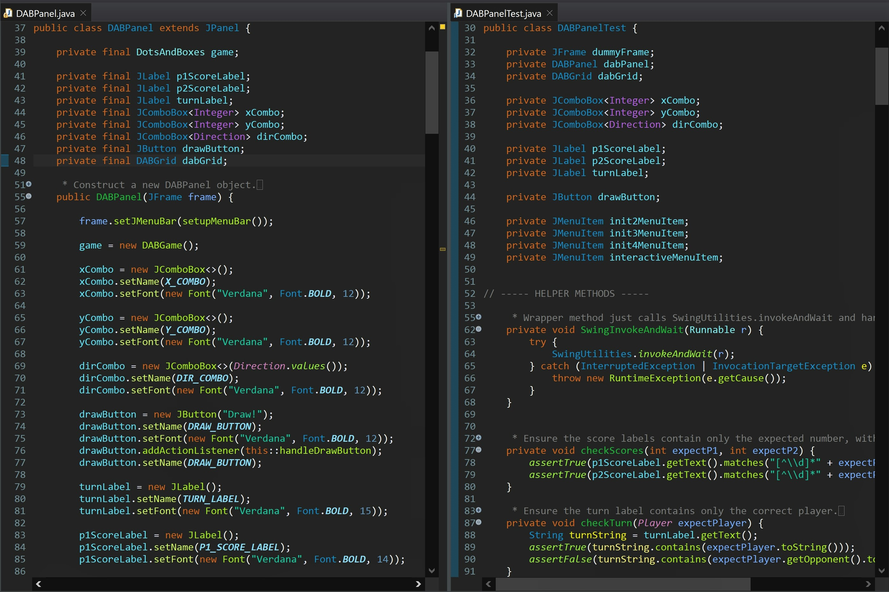

# 🖥️ CS 5044 – P5: Dots and Boxes GUI

---

## 🧠 What It Does

A Swing-based graphical front-end for the Dots and Boxes game engine from P4. Provides a
menu bar, status indicators, coordinate/direction input controls, and an interactive game
grid.

## 🎯 Why It Matters

Validated by a course-provided JUnit suite that drives the interface through real Swing
component interaction (simulated clicks, combo box selection) rather than calling engine
methods directly - closer to true end-to-end verification.

---

## ✨ Features

- Launches with a newly-initialized 3x3 game, menu bar, status indicators, and input
  components
- "Game" menu with a "New" submenu (2x2, 3x3, 4x4) and an "Interactive Grid" toggle
- Status indicators showing each player's score and whose turn it is (or a game-over
  message), always reflecting current game state
- Coordinate/direction drop-downs (options scoped to the current grid size) plus a
  "Draw!" button to attempt an edge, disabled once the game is over
- Integrates the `DABGrid` custom Swing component, which renders the grid and (in
  interactive mode) responds directly to mouse hover/click to draw edges

---

## 🛠️ Requirements

- JDK 17+ (developed/tested with Java 17)
- IntelliJ IDEA (Community Edition works fine)
- JUnit 4
- `dab5044.jar`, `dabgame-ref.jar`, `dabgui.jar` - all included in this repo

## ▶️ How to Run

1. Open IntelliJ IDEA
2. **File → Open**, select this project's folder (the one containing `src/` and `test/`)
3. Click **Trust Project** if prompted
4. Let IntelliJ finish indexing (progress bar at the bottom)
5. If prompted with "Cannot resolve symbol 'junit'", click **Add 'JUnit4' to classpath**
   (Alt+Shift+Enter)
6. If the `test` folder shows a "located outside of the module source root" warning,
   right-click the `test` folder → **Mark Directory as → Test Sources Root**
7. If you see "Cannot resolve symbol" errors for framework classes, add the three
   required jars (`dab5044.jar`, `dabgame-ref.jar`, `dabgui.jar`) as project libraries.
   Full steps below.

### 📦 Adding a Library Jar to the Project in IntelliJ

Repeat these steps once per jar (`dab5044.jar`, `dabgame-ref.jar`, `dabgui.jar`):

1. **File → Project Structure...** (Ctrl+Alt+Shift+S)
2. Click **Libraries** in the left sidebar
3. Click **+** → **Java**
4. Select the jar file (included in this repo's project root), click **OK**
5. Confirm the module checkbox is selected, click **OK**
6. **Apply**, then **OK** to close

Once all three are added, red underlines on `Player`, `Direction`, `Coordinate`,
`DotsAndBoxes`, `GameException`, and `DABGrid` should clear.

8. In the Project panel: `test → edu.vt.cs5044 → DABPanelTest`
9. Right-click `DABPanelTest` → **Run 'DABPanelTest'**

To see the actual GUI (not just the tests), right-click `DABPanel.java` →
**Run 'DABPanel.main()'** - a "Dots And Boxes" window should appear with a working 3x3
grid.

---

## ✅ Expected Output

All test methods should pass (green checkmarks in IntelliJ's test runner panel, process
exits with code 0). Note: `testCallMain` briefly flashes the full GUI window during the
test run - that's expected, not an error.

---

## 💻 Setting This Up on Another PC

**Option 1 — Download ZIP**
1. On GitHub, go to this repo → green **Code** button → **Download ZIP**
2. Unzip it wherever you want
3. Open the folder in IntelliJ (`File → Open`) and follow "How to Run" above

**Option 2 — Git Clone**
1. Install Git: https://git-scm.com/downloads
2. `git clone https://github.com/yourusername/your-repo.git`
3. Open the cloned folder in IntelliJ and follow "How to Run" above

---

## 📝 Notes

- `.idea/`, `out/`, `bin/`, `.settings/`, `.classpath`, and `.project` are intentionally
  not included.
- `dab5044.jar`, `dabgame-ref.jar`, and `dabgui.jar` are course-provided framework
  libraries, not written for this assignment - included in the repo so the project runs
  out of the box.
- `DABPanel.java` is the implementation written for this assignment; `DABPanelTest.java`
  was provided by the course to validate it and was used exactly as given, per the
  assignment instructions.
