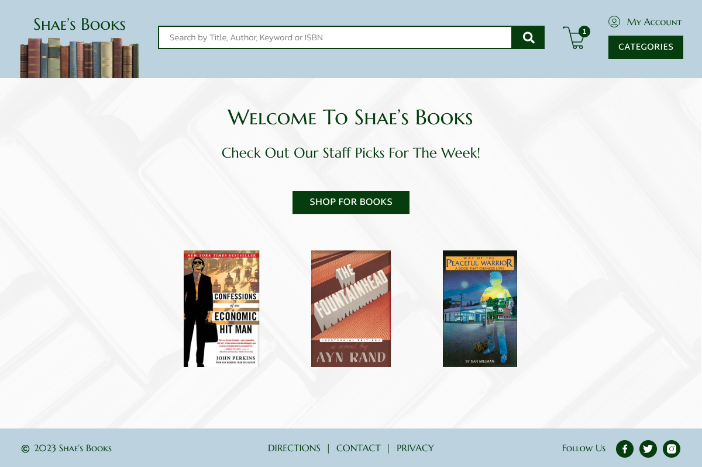
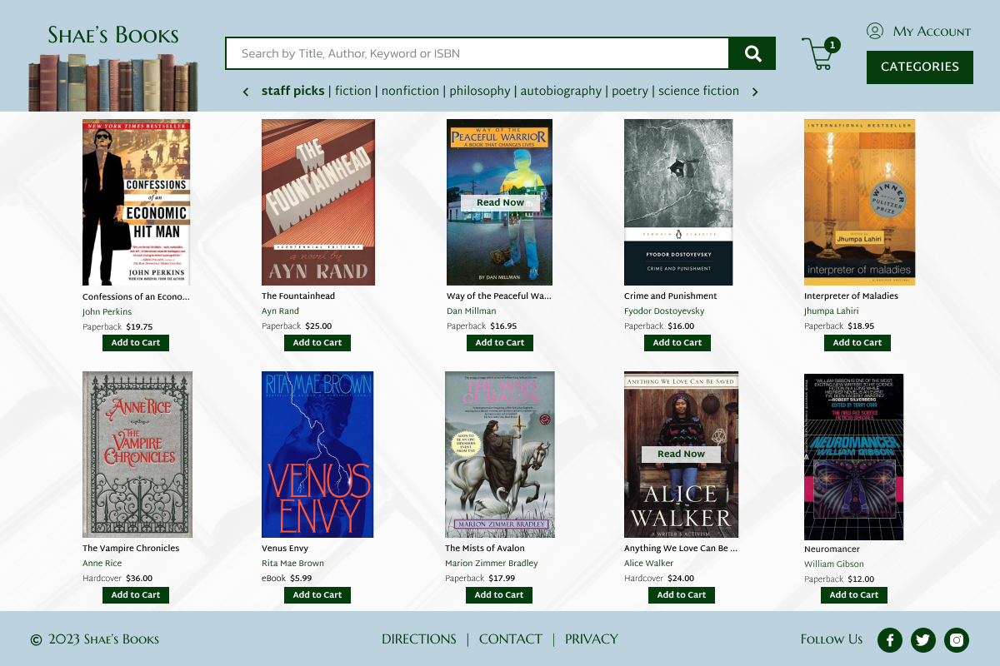

# 🎨 P1 — Application Design for Online Bookstore

### Figma mockups establishing the visual design system for "Shae's Books," carried forward into every later stage of the site

---

## 🧠 What It Does

Project 1 is a design-only deliverable: two Figma mockups (1200×800 JPEGs) for an online bookstore, "Shae's Books" — a Welcome Page and a Category Page — for a local bookstore owner expanding their business online, selling physical books and offering electronic access to public-domain titles.

## 🎯 Why It Matters

This establishes a consistent design system — colors, spacing, component layout, header/footer structure — that every later stage of the site implements against, rather than improvising layout decisions mid-build. The static HTML/CSS in Project 2, the Vue implementation starting in Project 3, and every project after it all trace their visual identity back to these two mockups.

## ✨ Features

- Shared header design across both pages: logo image and text, categories dropdown, search box with icon, log-in/log-out control, shopping cart icon with item count
- Shared footer design: copyright info, contact and directions links, social media icons (Facebook and Twitter)
- Welcome Page: bookstore name and logo, welcome text, featured categories/books with real images, a single call-to-action button ("Shop Now")
- Category Page: category navigation, a book grid (at least 2 columns × 2 rows), and book boxes containing image, title, author, price, and action buttons
- Real book cover images sourced from Alibris.com/Audible.com rather than placeholders
- Design principles applied from *The Non-Designer's Design Book* (contrast, repetition, alignment, proximity) and the "Designing for Accessibility" guidance

## 🛠️ Requirements

- A Figma account (free tier is sufficient)

## ▶️ How to Run

There is no runnable code at this stage. The deliverables are two JPEG images, viewable directly or reopened in Figma for editing:
- `Smith_Shannon_Pp1_Welcome_Page.jpg`
- `Smith_Shannon_Pp1_Category_Page.jpg`

## 🧪 Testing Approach

Verified against the assignment's detailed requirements list — header/footer consistency across both pages, a single call-to-action button on the Welcome Page, a book grid of at least 2×2 on the Category Page, and a visually distinct selected-category state — rather than automated testing, since this stage produces static design artifacts, not code.

## ✅ Expected Output

  

  

## 💻 Setting This Up on Another PC

No setup is required — the deliverables are static image files. To edit the original design, open the corresponding Figma project (requires a free Figma account).

## 📝 Notes

CSS-only animations and hover effects were planned for later implementation stages, avoiding JavaScript where possible, per the assignment's forward-looking constraint. This is the only project in the series with no code — implementation begins in Project 2.
