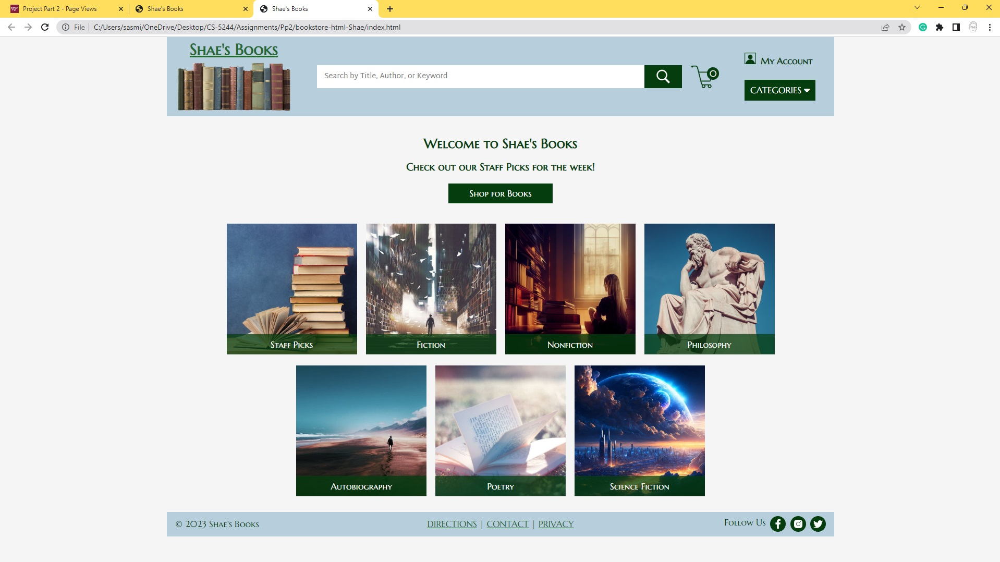
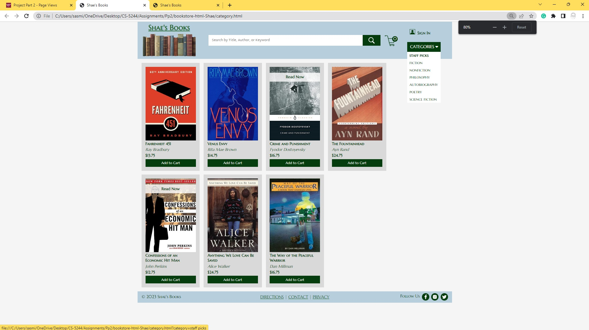

# 🏗️ P2 — Page Views (HTML/CSS)

### Translating the P1 Figma mockups into real, static HTML/CSS markup — no JavaScript, no frameworks

---

## 🧠 What It Does

Project 2 implements the Welcome Page and Category Page designed in Project 1 as static `index.html` and `category.html` files, styled with plain CSS. The category page displays one hardcoded category and its books at this stage; switching between categories dynamically comes in a later project.

## 🎯 Why It Matters

This confirms the Project 1 design holds up as real, responsive markup before any framework complexity is introduced — the same visual system, now actually rendered by a browser instead of a static image. It's also the last stage built without a framework: Project 3 reimplements this exact same content in Vue, and the CSS structure here is deliberately organized to anticipate that migration.

## ✨ Features

- `index.html` (home page) and `category.html` (category page), sharing an identical header and footer
- Logo image and logo text both link to the welcome page; all dropdown menu options link to the category page
- Search represented by an image (magnifying glass icon) rather than a button
- Shopping cart represented by an image, with the cart count placed sensibly over or inside the icon
- Categories menu uses a down-caret/arrow (or a standard hamburger icon if using a hamburger menu), hover-triggered at this stage
- Original logo, category images, book selection, fonts, and colors — none reused from the provided "Another Bookstore" starter code
- No bevel-style buttons; buttons replaced with images where Project 1's requirements called for icon-based controls
- CSS deliberately split across many small files (rather than one per page), anticipating Project 3's move to Vue components, where each component bundles its own HTML, JavaScript, and CSS

## 🛠️ Requirements

- Any modern web browser
- A text editor (no build tools or package manager needed at this stage)

## ▶️ How to Run

1. Open `index.html` directly in a browser (double-click, or drag into a browser window)
2. Navigate to `category.html` via the header's category dropdown

No server, build step, or local hosting is required — these are static files.

## 🧪 Testing Approach

Verified manually against the assignment's requirements list: layout integrity between 1000px and 1400px viewport width, ~200px book image height, padding around all elements, hover states on the category dropdown and category buttons, a visually distinct selected-category state, book boxes wrapping correctly as the page narrows, at least one book showing a "Read Now" button and at least one not, and title/author/price each styled distinctly from one another.

## ✅ Expected Output

  

  

## 💻 Setting This Up on Another PC

1. Clone this repository
2. Open `index.html` in any browser — no installation, build step, or dependencies required

## 📝 Notes

No JavaScript, SASS/preprocessors, or frameworks (e.g. Bootstrap) were used at this stage, per the assignment's constraints — plain HTML and CSS only.
