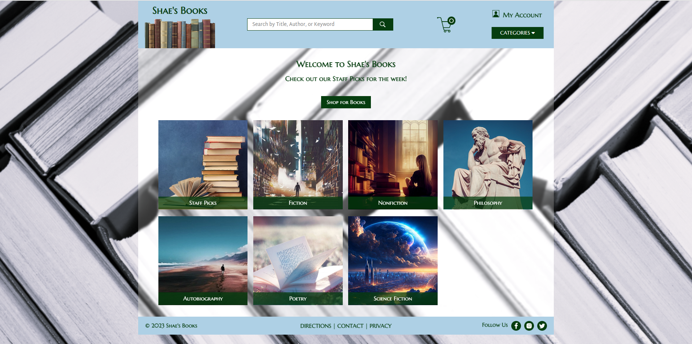
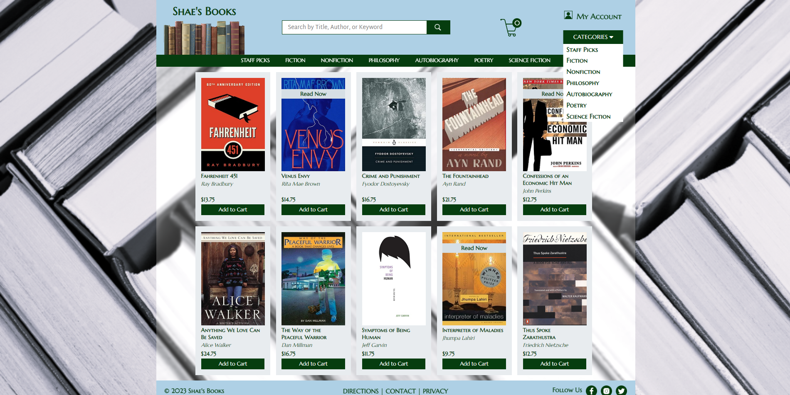

# 🖇️ CS 5244 – P3: Page Views in Vue

---

## 🧠 What It Does

Re-implementation of the P2 home page and category page as a Vue 3 Single-Page Application
(SPA), replacing static HTML pages with Vue views that render the same content and
behavior.

## 🎯 Why It Matters

First stage with an actual client/server project pair - the architecture every subsequent
project builds on - even though no dynamic data is served yet.

---

## 🧭 Overview

A single-page application uses one HTML page (`index.html`) and JavaScript to render
different "views" in place of separate pages. So this project doesn't produce two HTML
files like P2 did - it produces a home-page view and a category-page view within one Vue
app, with client-side routing handling navigation between them (e.g. `/category/mystery`
instead of a separate `category.html?name=mystery`).

Visually and functionally, the result should look and behave exactly like P2's
implementation - this stage is about the framework migration, not new features.

  

  

---

## 📦 Project Structure

- **`shae-bookstore-vue-client`** - the Vue 3 + Vite + TypeScript client application (home
  view, category view, routing)
- **`ShaeBookstoreVue`** - the Jakarta EE/Tomcat server module. At this stage it doesn't
  serve any dynamic data - its role is to host the built client files for deployment

---

## 🛠️ Requirements

- JDK 17+ (Java 19 also supported at the time this was built; Java 20 was explicitly
  unsupported due to a Gradle compatibility gap)
- Node.js (LTS) and Vite
- IntelliJ IDEA (Ultimate was used originally for Jakarta EE tooling; Community Edition
  works for the client side)
- Tomcat 10 (not 11) for local server deployment

## ▶️ How to Run

**Client (Vue app):**
1. Open `shae-bookstore-vue-client` in IntelliJ or VS Code
2. Open a terminal in the project directory
3. Run `npm install` (if not already done)
4. Run `npm run dev`
5. Open the printed `localhost:5173` link in the browser

**Server (Jakarta EE/Tomcat, for packaging/deployment):**
1. Open `ShaeBookstoreVue` in IntelliJ
2. Set up a Tomcat Local run configuration pointing at a local Tomcat 10 install, with
   application context `/ShaeBookstoreVue`
3. Run the Tomcat configuration - the default `index.jsp` page should load

For local development, the client (`npm run dev` on port 5173) is what's actually used
day-to-day; the server/Tomcat side matters for packaging the final build into a deployable
`.war`.

---

## ✅ Requirements Checklist

All P1 and P2 design requirements still apply. This stage should reproduce P2's behavior
exactly, just via Vue components and client-side routing instead of static HTML pages.

---

## 📝 Notes

At this stage there's no backend data - no database, no REST API, no fetch calls.
Category/book content is defined client-side. Dynamic data fetching from a real API begins
in a later project.
