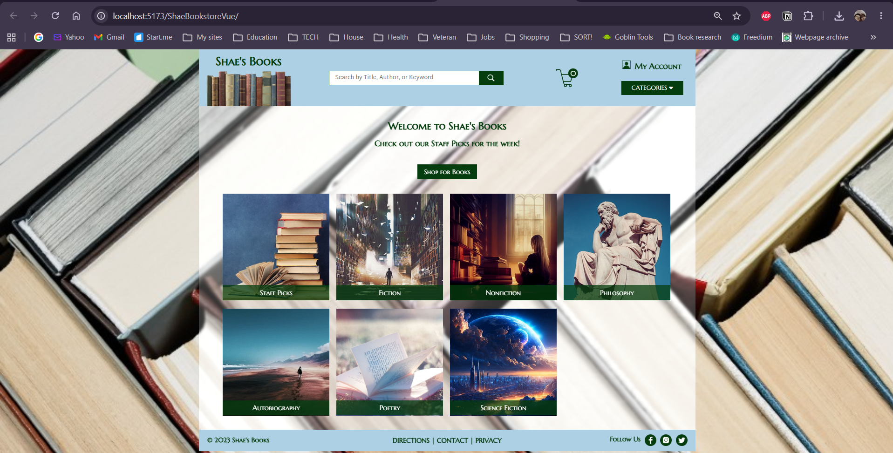
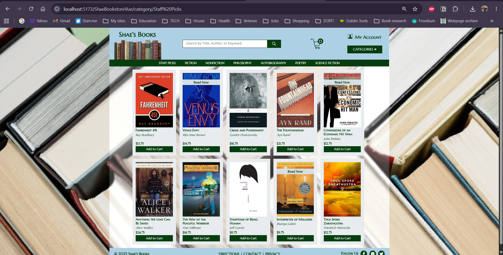

# 🖥️ P3 — Page Views in Vue

### Reimplementing a static HTML/CSS bookstore site as a Vue single-page application

---

## 🧠 What It Does

Project 3 reimplements the home page and category page built as static HTML/CSS in Project 2, this time as a Vue single-page application (SPA). Instead of two separate `.html` files, the site now consists of one `index.html` shell and two Vue *views* — a home view and a category view — swapped in and out by Vue Router as the user navigates, with the URL changing (e.g., `/category/mystery`) without a full page reload.

The project is split into two independent halves, matching this course's client/server pattern: **`shae-bookstore-vue-client`**, a Vite-built Vue 3 + TypeScript application containing all the actual page components, styling, and routing; and **`ShaeBookstoreVue`**, a minimal Jakarta EE/Tomcat server whose only job at this stage is to host the built client output as static files — no backend logic, database, or REST API exists yet.

## 🎯 Why It Matters

This is the pivot point from static markup to a real front-end framework. The visual result is deliberately identical to Project 2's HTML/CSS version — the point isn't a different-looking site, it's the same site rebuilt around Vue's component model, so that Project 4 onward can layer in dynamic, database-backed content without rewriting the presentation layer from scratch. It's also the first project where client and server are genuinely separate, independently-run applications during development (Vite's dev server on port 5173, Tomcat on port 8080), which is the standard architecture for the rest of this course.

## ✨ Features

- Home view and category view built as Vue components, matching Project 2's design
- Client-side routing via Vue Router, with clean URLs per category (no full page reloads)
- Reusable, composed components for headers, footers, category navigation, and book listings
- Hero-image styling on the home view, distinct from the default view background elsewhere on the site
- TypeScript throughout the client, with ESLint and Prettier configured for consistent style

## 🛠️ Requirements

- Node.js (LTS) and npm
- IntelliJ IDEA (or another editor) with the Vue plugin
- Java 17 SDK
- Apache Tomcat 10 (not 11)
- A modern browser (Chrome recommended, per course convention)

## ▶️ How to Run

**Client (development mode):**
1. Open the `shae-bookstore-vue-client` folder in a terminal
2. Run `npm install` (first time only, or after pulling fresh)
3. Run `npm run dev`
4. Open the printed URL — `http://localhost:5173/ShaeBookstoreVue/`

**Server (Tomcat):**
1. Open the `ShaeBookstoreVue` folder as a project in IntelliJ
2. Let Gradle sync complete
3. Set up a Tomcat 10 run configuration with the application context set to `/ShaeBookstoreVue`
4. Run it — `http://localhost:8080/ShaeBookstoreVue/`

The two run independently; during active development, the client's Vite dev server (5173) is what you'd normally use, since it supports hot-reloading. The Tomcat server (8080) serves whatever was most recently built and copied into its `webapp/` folder, and is closer to how the site would look once packaged for deployment.

## 🧪 Testing Approach

Verified manually by comparing the rendered home and category views against Project 2's static HTML/CSS pages, confirming visual parity — correct book and category images, correct logo and icons, correct hero background on the home view, and working navigation between views via the category dropdown, with the URL updating accordingly and no full-page reload occurring.

## ✅ Expected Output

The home view displays the hero background, logo, and category navigation exactly as designed in Project 2. Selecting a category from the dropdown navigates to that category's view, updating the URL and displaying the correct books, images, and pricing for that category.

## 💻 Setting This Up on Another PC

1. Clone this repository
2. For the client: open `shae-bookstore-vue-client` in a terminal, run `npm install`, then `npm run dev`
3. For the server: open `ShaeBookstoreVue` in IntelliJ, let Gradle sync, configure a Tomcat 10 run configuration with application context `/ShaeBookstoreVue`, then run
4. If npm or a downloaded PowerShell script isn't recognized, confirm Node.js is installed and on PATH, and that your PowerShell execution policy allows local scripts (`Set-ExecutionPolicy RemoteSigned -Scope CurrentUser`)

## 📝 Notes

Static assets (book covers, category images, icons, logo, hero background) are duplicated between the client's `public/` folder and the server's `webapp/` folder, since each runs as an independent application with its own asset resolution — a file added to one does not automatically appear in the other. Image filenames and formats are dictated by exact string references inside the Vue components and global stylesheet (for example, the hero background is specifically referenced as `background-image2.png`), so any replacement image must match the expected filename, not just the general subject matter.
