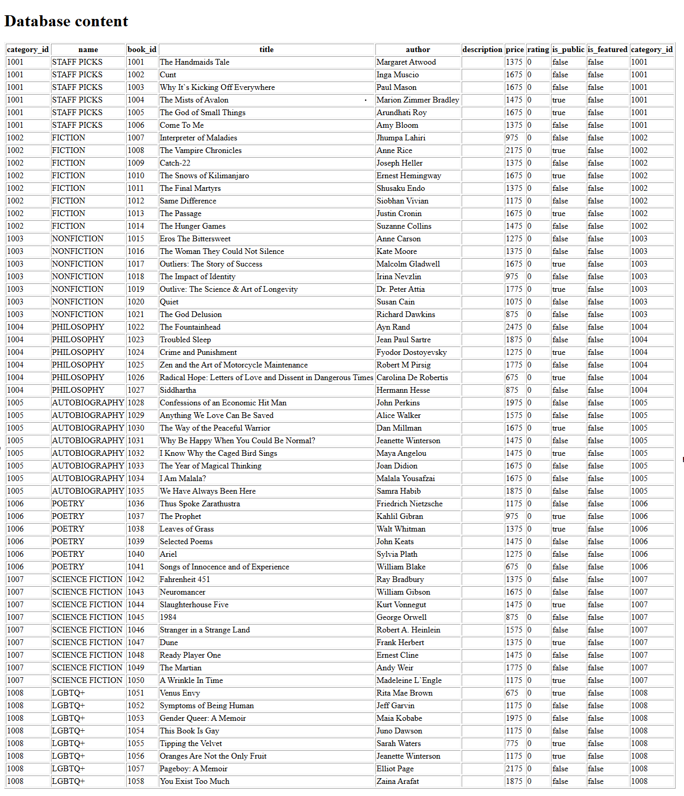
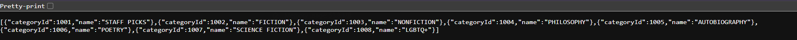

# 🗄️ CS 5244 – P4: DAO Pattern and REST API

---

## 🧠 What It Does

Introduces a database-backed server, built around the DAO (Data Access Object) pattern,
with two ways to reach the same underlying data: a JSP page that renders book and category
data directly via JSTL SQL tags, and a JAX-RS (Jersey) REST API exposing that same data as
JSON over a set of `/api/...` endpoints.

## 🎯 Why It Matters

This is where the site's data stops being hardcoded and starts coming from a real
database, and where the DAO pattern is introduced as the layer that isolates SQL from the
rest of the application - `Book` and `Category` model classes never touch JDBC directly,
that's entirely the job of `BookDaoJdbc` and `CategoryDaoJdbc`. The REST API built here is
also the foundation the Vue client will actually call starting in P5 (Fetch), replacing
the client-side-only category/book data used in P3.

---

## 🧭 Overview

The server is organized into two packages: `business`, which holds the DAO interfaces,
their JDBC implementations, and the `Book`/`Category` model classes; and `api`, which
holds the JAX-RS resource class exposing that data over HTTP.

`ApiApplication` declares the REST layer's base path as `/api` via `@ApplicationPath`.
`ApiResource` then defines endpoints under that base path for listing all categories,
fetching a single category or book by ID or by name, listing a category's books, and
fetching a random sample of "suggested" books from a category.

Separately, `index.jsp` queries the same database directly using JSTL's `<sql:query>` tag
and renders the results as an HTML table - useful as a quick sanity check that the
database connection and seed data are correct, independent of the REST layer.

  

  

---

## 📦 Project Structure

- **`ShaeBookstoreRest`** - the Jakarta EE/Tomcat server module. No client project exists
  at this stage; the REST API isn't consumed by the front end until P5.
  - `business/book/`, `business/category/` - model classes, DAO interfaces, and their JDBC
    implementations
  - `business/ApplicationContext.java` - singleton owner of the DAO instances
  - `api/ApiApplication.java`, `api/ApiResource.java` - the JAX-RS REST layer

---

## 🛠️ Requirements

- JDK 17
- IntelliJ IDEA
- Tomcat 10 (not 11)
- A local MySQL 8 instance with the `[Name]BookstoreDB` schema created and seeded (see
  `schema.sql` / `data.sql` under `src/main/resources`)

## ▶️ How to Run

1. Open `ShaeBookstoreRest` in IntelliJ and let Gradle sync
2. Update `src/main/webapp/META-INF/context.xml` to point at your local MySQL instance
   (`localhost`, your local credentials)
3. Set up a Tomcat 10 run configuration with application context `/ShaeBookstoreRest`
4. Run it
5. Visit `http://localhost:8080/ShaeBookstoreRest/` for the JSP data check, or
   `http://localhost:8080/ShaeBookstoreRest/api/categories` (and similar) for the REST API

---

## ✅ Requirements Checklist

- [x] Book and Category DAO interfaces with JDBC implementations
- [x] `index.jsp` renders live database content via JSTL
- [x] REST API under `/api` exposes categories and books as JSON
- [x] Category lookup by ID and by name
- [x] Book lookup by ID, by category ID, and a random "suggested books" sample

---

## 📝 Notes

The REST resource paths are plural (`categories`, `books`), not singular - a request to
`/api/category` will 404; the correct path is `/api/categories`. The `@ApplicationPath`
that actually controls the REST base path is declared on `ApiApplication` (which extends
`jakarta.ws.rs.core.Application`), not on `ApiResource` itself - an `@ApplicationPath`
annotation directly on a resource class has no effect.
