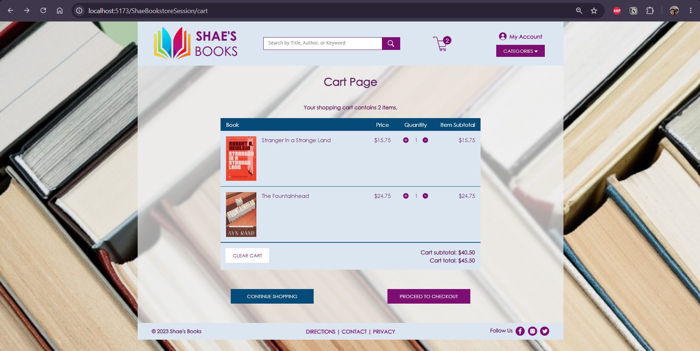

# 🛒 P7 — Session Management

### Adding a persistent shopping cart with local storage, a cart page, and a checkout stub

---

## 🧠 What It Does

Project 7 migrates `ShaeBookstoreSession` from Project 6's in-memory-only cart to a cart that persists across browser sessions using local storage. Every cart mutation (add, update quantity, clear) now writes the current cart state to the browser's local storage, and the cart store rehydrates itself from local storage on load — so a user's cart survives a page refresh or closing and reopening the browser. This project also adds a dedicated cart page with a full item table (image, title, price, quantity controls, subtotal) and a placeholder checkout page.

## 🎯 Why It Matters

Up to this point, the cart only existed in memory — refreshing the page silently wiped it out, which isn't how any real e-commerce site behaves. Persisting cart state to local storage is the first step toward a shopping experience that survives normal browsing behavior (tab switches, accidental refreshes, closing the browser to come back later). It also introduces the general pattern of syncing Pinia store state with browser storage, which is common in real single-page applications beyond just shopping carts.

## ✨ Features

- **Persistent cart** — `stores/cart.ts` reads from `localStorage` on initialization and writes to it after every cart-modifying action (`addToCart`, `updateBookQuantity`, `clearCart`)
- **`CartView.vue`** — dedicated cart page with a full grid-based item table
- **`CartTable.vue`** — CSS Grid layout with row separators, per-item increment/decrement controls, book image, title, unit price, and line subtotal, plus cart-level subtotal/total and a clear-cart action
- **Correct empty-cart state** — no empty table, no "$0.00," proper singular/plural item-count text ("1 item" vs. "2 items")
- **`CheckoutView.vue`** — placeholder checkout page (full functionality deferred to a later project)
- Cart icon and item count in `TheHeader` both link to `/cart`, with the cursor changing to a pointer on hover

## 🛠️ Requirements

- JDK 17
- IntelliJ IDEA
- Tomcat 10 (not 11)
- Node.js (LTS) and npm
- A local MySQL 8 instance with the `ShaeBookstoreDB` schema created and seeded
- `pinia` (`^2.0.32`) as a client dependency

## ▶️ How to Run

**Server:**
1. Open `ShaeBookstoreSession` in IntelliJ, let Gradle sync
2. Confirm `context.xml` points at your local MySQL instance (JNDI resource `jdbc/ShaeBookstore`)
3. Confirm nothing else is already bound to ports 8080/8005 before starting
4. Configure a Tomcat 10 run configuration with application context `/ShaeBookstoreSession`, then run

**Client:**
1. Open `shae-bookstore-session-client` in a terminal
2. Run `npm install`
3. Run `npm run dev`
4. Open the printed `localhost:5173` URL

The server must be running before the client.

## 🧪 Testing Approach

- Verified the cart persists across a full page reload: added multiple copies of a book, refreshed, confirmed quantities were unchanged
- Verified local storage directly via DevTools → Application tab: confirmed the `ShoppingCart` key updates on every add/update/clear action, not just on add
- Verified the empty-cart state matches every stylistic requirement in the assignment spec: no empty table rendered, no "$0.00" subtotal shown, correct singular/plural wording, "Proceed to Checkout" hidden when the cart is empty
- Verified in both the Vite dev server (port 5173) and the Tomcat-bundled production build (port 8080) — these were confirmed as two independent builds that must each be refreshed/rebuilt separately; see `TROUBLESHOOTING.md` for the deploy pipeline and cache pitfalls this surfaced

## ✅ Expected Output

The cart icon in the header shows a live item count. Clicking it navigates to `/cart`, which displays a table of cart contents (book image, title, quantity controls, unit price, and line subtotal), a running subtotal and total, and clear-cart / continue-shopping / proceed-to-checkout actions. Refreshing the page does not clear the cart.

## 💻 Setting This Up on Another PC

1. Clone this repository
2. Set up a local MySQL instance with the `ShaeBookstoreDB` schema (see `schema.sql` / `data.sql`)
3. Open `ShaeBookstoreSession` in IntelliJ, update `context.xml` (see `context.xml.example`), configure Tomcat, run
4. Open `shae-bookstore-session-client`, run `npm install` then `npm run dev`
5. Before checking the Tomcat-bundled version (port 8080) rather than the dev server, see `TROUBLESHOOTING.md` for the manual build-and-copy steps this project's Gradle build does **not** automate, plus a note on browser caching that can make a correctly-deployed build appear stale

## 📝 Notes

- The checkout page (`CheckoutView.vue`) is intentionally minimal per the assignment spec — a route, a short message, and nothing else. Full checkout functionality is expected in a later project.
- A known routing inconsistency exists between the "Proceed to Checkout" button's target and the registered `/checkout` route name — tracked as a deferred item rather than fixed in this pass, since checkout functionality itself isn't part of this project's scope. See `TROUBLESHOOTING.md`.
- As with `ShaeBookstoreState`, book image filenames are generated at runtime from the book's title and must end in `.png` to match the actual asset files.
