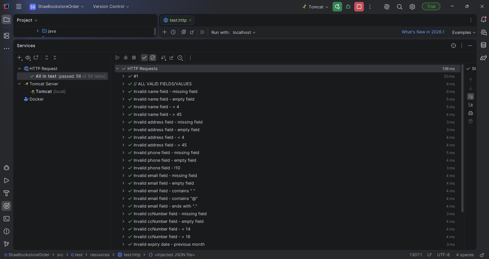

# 🛡️ P9 — Server-Side Validation

### Receiving and validating orders on the server, independent of (and never trusting) client-side validation

---

## 🧠 What It Does

Project 9 migrates `ShaeBookstoreOrder` from Project 8's client-only validated checkout to a real order-placement flow: the client now POSTs the full cart and customer form to a new `/api/orders` endpoint, and the server independently validates every field before accepting the order — never trusting that client-side Vuelidate checks were actually run. All validation failures are modeled as a single, consistent exception type (`ApiException.ValidationFailure`) with a centralized exception handler that returns a structured JSON error response with the correct HTTP status code.

## 🎯 Why It Matters

Client-side validation (P8) is a UX convenience — it can always be bypassed by a direct API call, a modified request, or a malicious client. Real data integrity has to be enforced server-side, independent of whatever the browser did or didn't check. This project also introduces a proper request/response contract for order placement: the client sends a `ShoppingCart` + `CustomerForm` as JSON, and the server responds with either a structured `OrderDetails` object on success or a structured error object (`reason`, `message`, `fieldName`, `error`) on failure — giving the client (and any other consumer of this API) a predictable shape to work with either way.

## ✨ Features

- **`POST /api/orders`** — new REST endpoint accepting the cart and customer form as JSON, currently returning a deliberate `400` with `"Transactions have not been implemented yet."` after validation passes (real order persistence is deferred to a later project)
- **`ApiException.ValidationFailure`** — a subclass of `ApiException` that optionally carries a `fieldName`, letting the centralized `ApiExceptionHandler` return field-specific errors where applicable and general errors where not (e.g. expiry date issues)
- **`DefaultOrderService`** — implements all required customer-form and cart validations:
  - Customer form: all fields required/non-empty; name and address 4–45 characters; phone exactly 10 digits after stripping formatting; email must contain `@`, no spaces, and can't end in `.`; credit card 14–16 digits after stripping formatting; expiry date must be the current month/year or later
  - Cart: at least one item; each item's quantity between 1 and 99; each item's price and category independently re-verified against the database rather than trusted from the client payload
- **`OrderService` wired into `ApplicationContext`** — follows the existing singleton pattern established for `BookDao`/`CategoryDao`, cooperating with `BookDao` without knowing about `ApplicationContext` itself
- **Client-side order submission** — `cartStore.placeOrder()` POSTs the order and clears the cart only on success; `CheckoutView.vue` distinguishes between a client validation failure (`ERROR`), a server-reported validation failure (`SERVER_ERROR`, with the server's actual message displayed), and success (`OK`)
- **`@JsonProperty` mapping** — reconciles the client's `ShoppingCart.itemArray` field name with the server's `items` field, since Jackson/Jersey require matching property names by default

## 🛠️ Requirements

- JDK 17
- IntelliJ IDEA
- Tomcat 10 (not 11)
- Node.js (LTS) and npm
- A local MySQL 8 instance with the `ShaeBookstoreDB` schema created and seeded
- `pinia`, `@vuelidate/core`, and `@vuelidate/validators` as client dependencies
- `build.gradle` must include the JAX-B dependencies for JSON processing (present by default if built from the Project 4 template)

## ▶️ How to Run

**Server:**
1. Open `ShaeBookstoreOrder` in IntelliJ, let Gradle sync
2. Confirm `context.xml` points at your local MySQL instance (JNDI resource `jdbc/ShaeBookstore`)
3. Confirm nothing else is already bound to ports 8080/8005 before starting
4. Configure a Tomcat 10 run configuration — **explicitly set the Application context to `/ShaeBookstoreOrder`** in the Deployment tab, since a fresh run configuration defaults to an auto-generated context (e.g. `/Gradle___ShaeBookstoreOrder_war`) that will 404
5. Run

**Client:**
1. Open `shae-bookstore-order-client` in a terminal
2. Run `npm install`
3. Run `npm run dev`
4. Open the printed `localhost:5173` URL

## 🧪 Testing Approach

Server-side validation is genuinely hard to exercise through the browser (client-side Vuelidate blocks most invalid submissions before they ever reach the network), so this project is tested directly against the API using IntelliJ's built-in HTTP Client (`src/test/resources/test.http`):

- A real `placeOrder` request was captured from the browser (DevTools → Network → Copy as cURL on the actual POST), then pasted into `test.http`, where IntelliJ automatically converts it into its own request format
- That captured request was then duplicated and mutated by hand into a full matrix of missing / empty / invalid / valid cases for every customer-form field (name, address, phone, email, ccNumber), plus expiry-date and cart-specific cases (quantity bounds, price mismatch, category mismatch)
- Each named test asserts on the response status code and, where applicable, the returned `fieldName`
- Full suite: **56/56 passing** (28 named test cases × request + response assertions each), confirming distinct, correctly field-tagged validation failures for every required case, and confirming valid input consistently returns the expected `"Transactions have not been implemented yet."` message with a `400` status

## ✅ Expected Output

Running the full `test.http` suite in IntelliJ shows every validation case — missing/empty/boundary values across name, address, phone, email, ccNumber, and expiry date — passing with the correct status code and field-specific error response.

## 💻 Setting This Up on Another PC

1. Clone this repository
2. Set up a local MySQL instance with the `ShaeBookstoreDB` schema (see `schema.sql` / `data.sql`)
3. Open `ShaeBookstoreOrder` in IntelliJ, update `context.xml` (see `context.xml.example`), configure Tomcat **with an explicit Application context**, run
4. Open `shae-bookstore-order-client`, run `npm install` then `npm run dev`
5. To exercise server-side validation directly, open `src/test/resources/test.http`, update the `[Name]` in the sample category request, and run the full suite via the green run-all icon in the Services panel
6. Before checking the Tomcat-bundled version (port 8080) rather than the dev server, see `TROUBLESHOOTING.md` for the manual build-and-copy steps this project's Gradle build does **not** automate

## 📝 Notes

- Order placement always fails with `"Transactions have not been implemented yet."` on valid input — this is intentional, required stub behavior per the assignment spec, not a bug. Real transaction/order persistence is expected in a later project.
- A fresh IntelliJ run configuration for a new project copy does not inherit an existing Tomcat setup — a new Tomcat Server configuration has to be created from scratch, and its Application context field defaults to an auto-generated value that will 404 until set explicitly. See `TROUBLESHOOTING.md`.
- As with prior projects, a fresh project copy starts with no `webapp/index.html` or `assets/` until the client is built and copied over, and the `.jpg`/`.png` book-image filename bug reappears in each fresh copy since it lives in component source that gets copied forward unmodified. See `TROUBLESHOOTING.md`.
