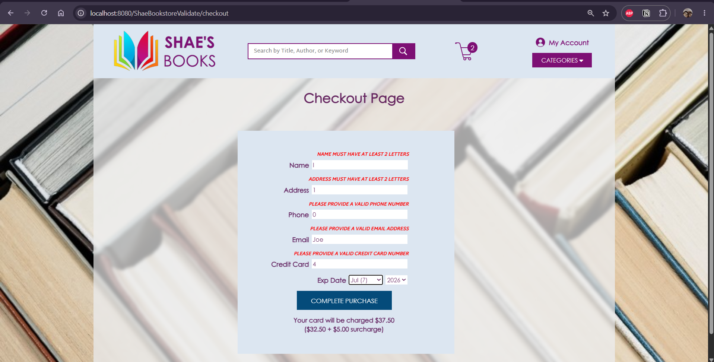

# 📚 CS 5244 – Web Application Development (Virginia Tech)
## 🛒 Shae's Books — Full-Stack Bookstore Application

---

## 🧠 What This Is

A full-stack online bookstore application, "Shae's Books," built in ten staged projects -
starting from Figma wireframes, through static HTML/CSS, a Vue.js single-page application,
a Java DAO/REST API backend, and finishing with server-side transactions and hardened
routing. Each stage adds one architectural layer on top of the last, culminating in a
complete client-server e-commerce flow: category browsing, a persistent shopping cart,
client- and server-side validated checkout, and real database transactions.

**Status note:** This repo was originally built against a MySQL database hosted on
Virginia Tech's course server, which stopped being reachable post-graduation. All ten
projects have since been revived and verified working end-to-end against a local MySQL
instance, with full setup instructions in each stage's own README. Getting there involved
a fair amount of real environment troubleshooting - stale processes, build pipeline gaps,
browser caching - all documented in the repo-wide `TROUBLESHOOTING.md`.

---

## 🧬 Project Progression

---

### 🎨 P1 — [Application Design](./P1) 🔗

| Category | Details |
|---|---|
| Focus | Wireframing a Welcome Page and Category Page |
| Type | Design deliverable (Figma) |
| Output | Two annotated page mockups |

**What it does:** Designs the visual identity and layout for Shae's Books - logo, header/
footer, category navigation, and book grid - applying accessibility guidance and core
design principles before any code is written.

**Why it matters:** Establishes a consistent design system (colors, spacing, component
layout) that every later stage - static HTML, then Vue, then the full application -
implements against, rather than improvising layout decisions mid-build.

---

### 🏗️ P2 — [Page Views (HTML/CSS)](./P2) 🔗

| Category | Details |
|---|---|
| Focus | Translating the Figma design into real markup |
| Type | Static HTML/CSS site |
| Output | `index.html`, `category.html` |

**What it does:** Implements the Welcome Page and Category Page as plain HTML and CSS - no
JavaScript, no frameworks, no preprocessors - with CSS deliberately split across files that
anticipate the Vue component boundaries introduced in the next project.

**Why it matters:** Confirms the design holds up as real, responsive markup (1000px-1400px)
before any framework complexity is introduced.

---

### 🖇️ P3 — [Page Views in Vue](./P3) 🔗

| Category | Details |
|---|---|
| Focus | Migrating static pages into a Vue Single-Page Application |
| Type | Vue 3 + Vite client, Jakarta EE/Tomcat server shell |
| Output | Home view and category view, client-side routed |

**What it does:** Re-implements the same two pages as Vue 3 views within one SPA, using
client-side routing (`/category/mystery`) in place of separate HTML files, with a Jakarta
EE server module set up to host the built client for deployment.

**Why it matters:** First stage with an actual client/server project pair - the
architecture every subsequent project builds on - even though no dynamic data is served
yet.

---

### 🔌 P4 — [DAO Pattern and REST API](./P4) 🔗

| Category | Details |
|---|---|
| Focus | MySQL-backed REST API using the DAO pattern |
| Type | Java/Jersey REST API |
| Output | `/api/categories`, `/api/books`, and related endpoints, backed by real DAO classes |

**What it does:** Introduces a database-backed REST API serving category and book data as
JSON, built with the DAO (Data Access Object) pattern - `CategoryDao`/`CategoryDaoJdbc`,
`BookDao`/`BookDaoJdbc` - to separate persistence logic (raw JDBC, no ORM) from the REST
resource layer (`ApiResource`, built on Jersey/JAX-RS). A singleton `ApplicationContext`
owns and wires together every DAO and service, a pattern every later project (P6's
category/book stores, P9-P10's order service) continues to build on.

**Why it matters:** Establishes the layering discipline the rest of the project depends on
- controllers never talk to the database directly, and every table has a clean interface/
implementation split, which is what makes wiring in three new tables in P10 a matter of
following an existing pattern rather than inventing a new one.

---

### 📡 P5 — [Fetch](./P5) 🔗

| Category | Details |
|---|---|
| Focus | Connecting the Vue client to the live REST API |
| Type | Vue 3 client + Jakarta EE server |
| Output | Live category/book browsing, replacing static/local data |

**What it does:** Connects the Vue client to the REST API built in P4, replacing the
client's local/static category and book data with live `fetch()` calls. The server adds a
`CorsFilter` to permit cross-origin requests from the Vite dev server (port 5173) to the
Tomcat-hosted API (port 8080), and book cover images are resolved by deriving a filename
from each book's title returned by the API.

**Why it matters:** This is where the client stops being a self-contained demo and becomes
a genuine consumer of a real backend - every category and book shown in the UI now
reflects the actual state of the database. It also introduces CORS as a practical concern:
a browser-based client talking to a server on a different origin needs the server to
explicitly allow it, or every request silently fails.

---

### 🗃️ P6 — [State Management](./P6) 🔗

| Category | Details |
|---|---|
| Focus | Centralizing server access and global state |
| Type | Vue 3 client (Pinia) + Jakarta EE server |
| Output | Category, book, and cart Pinia stores, replacing scattered `fetch` calls and `provide`/`inject` |

**What it does:** Migrates from P5's scattered per-component `fetch()` calls to a
centralized state layer built on Pinia. A single `api.ts` computes the API base URL once,
and three Pinia stores - category, book, and cart - own all global state that was
previously duplicated across components or threaded through the tree via `provide`/
`inject`.

**Why it matters:** Before this, every component needing category or book data fetched it
independently, with no single source of truth and no clean way to share state between
unrelated components (like keeping a cart badge in the header in sync with an "add to
cart" click three components away). One fetch per data type, one source of truth,
any component can read or mutate shared state by importing the relevant store.

---

### 🛍️ P7 — [Session Management](./P7) 🔗

| Category | Details |
|---|---|
| Focus | A persistent shopping cart with local storage |
| Type | Vue 3 client (Pinia + localStorage) + Jakarta EE server |
| Output | Full cart page, quantity controls, checkout page stub |

**What it does:** Adds cart persistence across browser sessions - every cart mutation
(add, update quantity, clear) writes to `localStorage`, and the cart store rehydrates
itself on load, so a user's cart survives a page refresh or closing and reopening the
browser. Adds a dedicated cart page with a full CSS Grid item table (image, title, price,
quantity controls, subtotal) and a placeholder checkout page.

**Why it matters:** Up to this point the cart only existed in memory - refreshing the page
silently wiped it out, which isn't how any real e-commerce site behaves. This is the first
step toward syncing Pinia store state with browser storage, a pattern reused (with
`sessionStorage` instead) for order confirmation details in P10.

---

### ✅ P8 — [Client-Side Validation](./P8) 🔗

| Category | Details |
|---|---|
| Focus | A full checkout form with Vuelidate-powered validation |
| Type | Vue 3 client (Vuelidate) + Jakarta EE server |
| Output | Checkout form (name, address, phone, email, credit card, expiry) with inline error messaging |

**What it does:** Builds out a complete checkout form - name, address, phone, email,
credit card number, expiry - validated client-side with Vuelidate before the order can
proceed, using both Vuelidate's built-in validators (`required`, `email`, `minLength`,
`maxLength`) and custom regex-based validators (`isMobilePhone`, `isCreditCard`) paired
with a reusable inline error component.

**Why it matters:** Client-side validation is the first line of defense against malformed
data reaching the server, giving users immediate, specific feedback instead of a failed
request after the fact. No HTML5 validation is used anywhere - every check runs through
Vuelidate, which is what makes the rules declarative and centrally testable rather than
scattered across `required`/`minlength` attributes.

---

### 🛡️ P9 — [Server-Side Validation](./P9) 🔗

| Category | Details |
|---|---|
| Focus | Independently validating every order on the server |
| Type | Vue 3 client + Jakarta EE server (`POST /api/orders`) |
| Output | Field-aware validation errors, structured JSON error responses |

**What it does:** Adds a `POST /api/orders` endpoint that independently re-validates
everything the client already checked in P8 - and more, including re-verifying each cart
item's price and category against the database rather than trusting the client's payload.
All validation failures are modeled as a single exception type
(`ApiException.ValidationFailure`), handled centrally by an `ApiExceptionHandler` that
returns a consistent, structured JSON error shape (`reason`, `message`, `fieldName`,
`error`) with the correct HTTP status code.

**Why it matters:** Client-side validation can always be bypassed - a direct API call, a
modified request, a malicious client. Real data integrity has to be enforced server-side,
independent of whatever the browser did or didn't check. Verified directly against the API
using a 56-case test matrix (missing/empty/invalid/valid × every field) via IntelliJ's HTTP
Client, entirely independent of the browser.

---

### 💳 P10 / P10H — [Transactions & Hardening](./P10) 🔗

| Category | Details |
|---|---|
| Focus | Real database transactions and a final hardening pass |
| Type | Vue 3 client + Jakarta EE server, MySQL (raw JDBC) |
| Output | A working order-placement flow, real confirmation page, navigation-resilient SPA |

**What it does:** Orders now actually persist. `placeOrder` writes across three related
tables - `customer`, `customer_order`, and `customer_order_line_item` - inside a single
manually-managed JDBC transaction (`setAutoCommit(false)`, commit on success, rollback on
any failure), since each insert depends on the previous one's generated ID. The
confirmation page renders the resulting order live: confirmation number, timestamp,
customer info, a masked card number (truncated to the last 4 digits server-side, at the
data model level, so the full number never leaves the server), and a per-item breakdown
with subtotal/surcharge/total - backed by a `sessionStorage`-based Pinia store so
confirmation details survive a reload but correctly clear on browser restart. P10H then
hardens the whole SPA against real browsing behavior: homepage reachable via multiple
paths, correct behavior on reload/back-button/direct-URL-entry for every page, a real 404
page, and a checkout button disabled during submission to prevent duplicate orders.

**Why it matters:** This is the payoff for every prior stage - real, verified,
multi-table transactional writes, not just validated form state. It's also the difference
between a site that only works when clicked through in the "intended" order and one that
behaves correctly under how people actually use browsers: reloading, hitting back,
bookmarking, and typing URLs directly.

---

## 🧠 How the Ten Projects Connect

| Stage | What It Adds | Key Technology |
|---|---|---|
| P1-P2 | Design and static implementation | Figma, HTML/CSS |
| P3 | SPA architecture, client/server split | Vue 3, Vite, Jakarta EE |
| P4-P5 | Real backend data, DAO pattern, REST | Java, Jersey, MySQL |
| P6-P7 | Centralized state, persistent cart | Pinia, localStorage |
| P8-P9 | Validation, client and server | Vuelidate, server-side checks |
| P10 | Real transactions, production-grade routing | JDBC transactions, sessionStorage |

---

## 📸 Highlights

 
  
 

*Category browsing with live data (P6) · Persistent shopping cart (P7) · Client-side
validation catching invalid input in real time (P8) · A completed, real database
transaction (P10)*

---

## 🛠️ Tech Stack

| Component | Detail |
|---|---|
| Frontend | Vue 3, Vite, TypeScript, Pinia, Vuelidate |
| Backend | Java, Jakarta EE, Eclipse Jersey (JAX-RS) |
| Database | MySQL 8 (raw JDBC, DAO pattern - no ORM) |
| Server | Apache Tomcat 10 |
| Validation | Vuelidate (client), independent server-side validation (defense in depth) |

---

## 👤 Shannon Smith

Cybersecurity | SOC Operations • Detection Engineering • Incident Response

