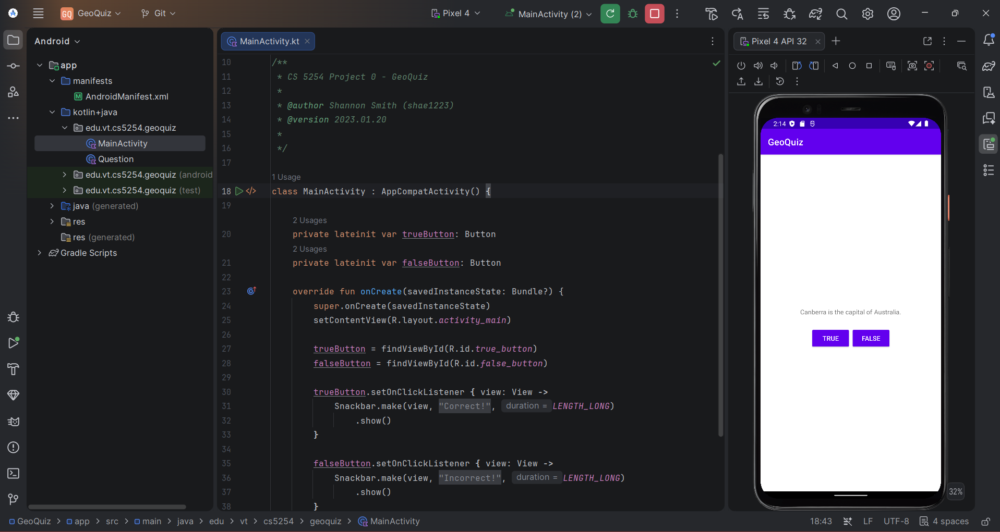

# 📱 P0: GeoQuiz

### A first-principles Android app introducing activity lifecycle, view binding, and user interaction in Kotlin

---

## 🧠 What It Does

GeoQuiz is a single-screen quiz app that cycles through a small set of true/false geography questions, giving the user immediate feedback via a `Snackbar` when they tap **TRUE** or **FALSE**. Each question is modeled as a `Question` data class pairing a string resource ID with its correct boolean answer, stored in a list and advanced via a "Next" button — the base BNRG tutorial's single hardcoded question, extended into the multi-question challenge at the end of the chapter.

Under the hood, it's a minimal but complete `AppCompatActivity`: the layout is inflated with `setContentView()`, view components are wired up with `findViewById()`, and each button's `setOnClickListener` checks the tapped answer against the current `Question`'s stored `answer` value, triggering a `Snackbar.make()` call with a "Correct!" or "Incorrect!" message pulled from `strings.xml`.

## 🎯 Why It Matters

This project is the entry point into Android development — the goal isn't complexity, it's establishing the core mental model every later project builds on: how an `Activity` is created, how a layout XML file becomes a live UI, and how user interaction routes back into Kotlin code through listeners and simple data classes. Every subsequent project in this portfolio (MultiQuiz, DreamCatcher, FancyGallery) extends directly from these same fundamentals — activities, views, and event handling — before layering on ViewModels, fragments, and navigation.

## ✨ Features

- Multiple true/false geography questions, cycled via a "Next" control
- Questions modeled as a lightweight `Question` data class (string resource + correct answer)
- Instant feedback via Android's `Snackbar` component
- All user-facing strings externalized to `strings.xml` (no hardcoded text)
- Borderless button styling to avoid a layout quirk in horizontal `LinearLayout` button bars

## 🛠️ Requirements

- Android Studio (Electric Eel or later recommended)
- Android SDK Platform 32 (Android 12L)
- Kotlin plugin (bundled with Android Studio)
- An emulator or physical device running API 21+

## ▶️ How to Run

1. Open the project root folder in Android Studio (`File → Open`, select the `GeoQuiz` folder)
2. Let Gradle sync complete
3. Select or create a **Pixel 4 API 32** emulator via **Device Manager**
4. Click **Run ▶️** with the `app` configuration selected

## 🧪 Testing Approach

This project predates the instrumented test suites introduced in later assignments. Verification was done manually: confirming the correct question text displays, and that tapping each button produces the expected Snackbar message ("Correct!" for TRUE, "Incorrect!" for FALSE).

## ✅ Expected Output

Tapping **TRUE** or **FALSE** displays a "Correct!" or "Incorrect!" Snackbar depending on whether it matches the current question's stored answer. Tapping **Next** advances to the following question in the list, wrapping back to the first after the last.

## 💻 Setting This Up on Another PC

1. Clone this repository
2. Open the `GeoQuiz` folder as a project in Android Studio
3. If prompted about Gradle/JDK compatibility, select a **JDK 17** toolchain — this project uses an older Gradle version (7.5) that is not compatible with newer JDKs (21+)
4. Sync Gradle, then build and run as described above

## 📝 Notes

The project targets `edu.vt.cs5254.geoquiz` and follows the BNRG (*Big Nerd Ranch Guide*) Chapter 1 tutorial structure, including the end-of-chapter challenge that extends the base single-question example into a multi-question quiz using a `Question` data class.
