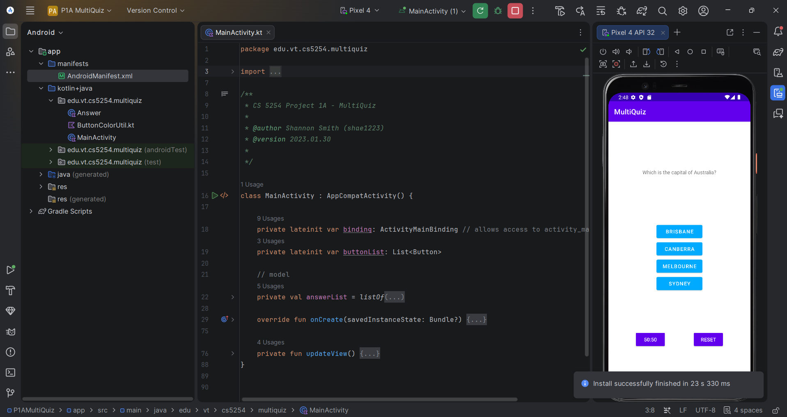

# 🧩 MultiQuiz — Part 1A: Single Question

### An Android quiz screen introducing View Binding, functional-style list processing, and multi-state button interaction

---

## 🧠 What It Does

MultiQuiz P1A presents a single multiple-choice question with four answer buttons ("Brisbane," "Canberra," "Melbourne," "Sydney"), each backed by an `Answer` data class tracking its selected/enabled state. Tapping an unselected answer selects it and deselects any other; tapping the currently selected answer deselects it. A **50:50** lifeline button disables the first two incorrect answers (deselecting either if it had been chosen) and then disables itself, while a **Reset** button restores every answer to its enabled, deselected starting state — including re-enabling the lifeline.

The app uses **View Binding** rather than `findViewById()` to access layout components, and leans on Kotlin's functional collection operations (`zip`, `filter`, `forEach`, `take`) rather than manual indexing or imperative loops to process the answer list.

## 🎯 Why It Matters

This is the first of a three-part build (1A → 1B → 1C) that grows into a full multi-question quiz app with scoring and a results screen. P1A's scope is deliberately narrow — selection state, the lifeline mechanic, and reset — with no answer submission or correctness feedback yet; that logic is introduced in Part 1B. Isolating this layer first makes the state-management logic (which answers are enabled/selected, and how the lifeline button's own enabled state depends on the *other* buttons' state) easy to reason about before scoring and navigation are layered on top.

## ✨ Features

- Four-answer multiple-choice interface with mutually exclusive selection
- 50:50 lifeline that removes two incorrect options and disables itself after use
- Reset control that restores the full initial state, including the lifeline
- View Binding for type-safe access to layout views
- Kotlin functional-style list processing (`zip`, `filter`, `forEach`, `take`) in place of manual loops

## 🛠️ Requirements

- Android Studio (Electric Eel or later recommended)
- Android SDK Platform 32 (Android 12L)
- Kotlin plugin (bundled with Android Studio)
- An emulator or physical device running API 21+

## ▶️ How to Run

1. Open the project root folder in Android Studio (`File → Open`, select the `P1AMultiQuiz` folder)
2. Let Gradle sync complete
3. Select or create a **Pixel 4 API 32** emulator via **Device Manager**
4. Click **Run ▶️** with the `app` configuration selected

## 🧪 Testing Approach

Verified manually by exercising every interaction path: selecting and deselecting each answer individually, confirming only one answer can be selected at a time, triggering the 50:50 lifeline and confirming exactly two incorrect answers become disabled (and that the lifeline itself becomes disabled afterward), and confirming Reset restores every answer — plus the lifeline — to its original enabled, deselected state.

## ✅ Expected Output

Selecting an answer highlights it while deselecting any previously selected answer. Tapping 50:50 disables two incorrect options and greys out the lifeline button itself. Tapping Reset returns the screen to its initial state.

## 💻 Setting This Up on Another PC

1. Clone this repository
2. Open the `P1AMultiQuiz` folder as a project in Android Studio
3. If prompted about Gradle/JDK compatibility, select a **JDK 17** toolchain
4. Sync Gradle, then build and run as described above

## 📝 Notes

The project targets `edu.vt.cs5254.multiquiz`. The `Answer.kt` and `ButtonColorUtil.kt` classes were provided course scaffolding, integrated as-is; `MainActivity.kt` contains the interaction logic described above.
