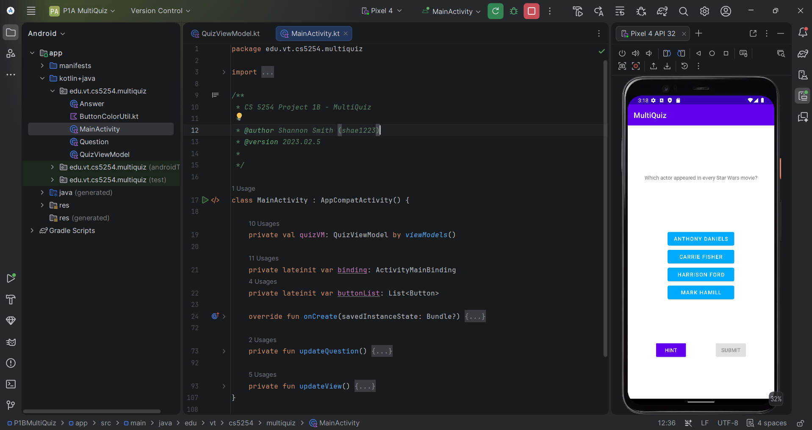

# 🧩 MultiQuiz — P1B: Multiple Questions

### Extending the single-question quiz into a multi-question flow backed by a ViewModel for rotation-safe state

---

## 🧠 What It Does

MultiQuiz P1B extends Part 1A into a four-question quiz, cycling through questions via a **Submit** button (replacing 1A's Reset) and revealing wrong answers one at a time via a **Hint** button (replacing 1A's 50:50 lifeline). All mutable quiz state — which answers are selected/enabled, which question is current — now lives in a `QuizViewModel` rather than the Activity, so the entire quiz state survives configuration changes like screen rotation.

Submit starts disabled and only enables once an answer is selected; clicking it advances to the next question, wrapping back to the first after the fourth. If a question is revisited later, its exact prior state — selections, disabled answers, and Hint's enabled/disabled status — is restored rather than reset, since each question's state is tracked independently in the ViewModel.

## 🎯 Why It Matters

This is the middle installment of the three-part MultiQuiz build, and the one where state management stops being trivial. Once there's more than one question and the screen can rotate at any moment, "what does the UI currently look like" and "what is the actual state of the quiz" have to be kept in sync deliberately — which is exactly the problem a `ViewModel` solves. Getting this pattern right here is the foundation for the much more complex list-detail state management used later in the DreamCatcher projects.

## ✨ Features

- Four multiple-choice questions, each with four answers, cycled via Submit
- Per-question state persistence — revisiting a question restores its exact prior selection/hint state
- Hint button that reveals one wrong answer at a time, disabling itself once no wrong answers remain
- Submit button that stays disabled until an answer is selected
- Full state survival across device rotation via `QuizViewModel`
- Kotlin functional-style list processing throughout

## 🛠️ Requirements

- Android Studio (Electric Eel or later recommended)
- Android SDK Platform 32 (Android 12L)
- Kotlin plugin (bundled with Android Studio)
- An emulator or physical device running API 21+

## ▶️ How to Run

1. Open the project root folder in Android Studio (`File → Open`, select the `P1BMultiQuiz` folder)
2. Let Gradle sync complete
3. Select or create a **Pixel 4 API 32** emulator via **Device Manager**
4. Click **Run ▶️** with the `app` configuration selected

## 🧪 Testing Approach

Verified manually across the full interaction surface: selecting/deselecting answers and confirming Submit's enabled state tracks selection correctly, using Hint repeatedly until it self-disables, submitting through all four questions and confirming the wraparound back to the first, revisiting an already-answered question and confirming its prior state (selection, disabled answers, Hint status) is restored exactly, and rotating the device mid-quiz to confirm no state is lost.

## ✅ Expected Output

Selecting an answer enables Submit. Using Hint disables one wrong answer at a time until only the correct answer and one wrong answer remain enabled, at which point Hint disables itself. Submit advances through all four questions in sequence.

## 💻 Setting This Up on Another PC

1. Clone this repository
2. Open the `P1BMultiQuiz` folder as a project in Android Studio
3. If prompted about Gradle/JDK compatibility, select a **JDK 17** toolchain
4. Sync Gradle, then build and run as described above

## 📝 Notes

The project targets `edu.vt.cs5254.multiquiz`. `Answer.kt`, `ButtonColorUtil.kt`, and `Question.kt` were provided course scaffolding, integrated as-is; `MainActivity.kt` and `QuizViewModel.kt` contain the interaction and state-management logic described above.
