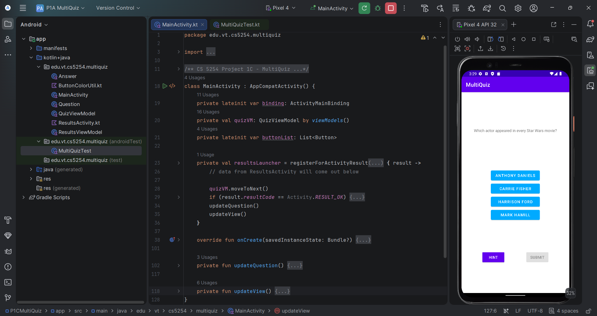

# 🧩 MultiQuiz — Part 1C: Results Activity

### Completing the MultiQuiz build with a second activity, inter-activity data passing, and a full instrumented test suite

---

## 🧠 What It Does

MultiQuiz P1C completes the three-part build by adding a **ResultsActivity**, reached after submitting the fourth and final question. Three running statistics — correct answers, submitted answers, and hints used — are passed from `MainActivity` to `ResultsActivity` as Intent extras with explicit key names, then displayed on a dedicated results screen.

From Results, the user can press **Back** to return to the quiz with no changes, or tap **Reset All** to zero every stat, disable the Reset All button, and — upon returning via Back — restore every question to its fully untouched starting state (all answers enabled and deselected, Hint enabled, Submit disabled). A `newIntent()` factory function on `ResultsActivity`'s companion object builds the launching Intent, following standard Android convention for non-default activities.

## 🎯 Why It Matters

This project introduces the two-activity pattern and the mechanics of passing typed data between activities via Intent extras — a foundational Android navigation concept that predates the Fragment-based navigation used in the DreamCatcher and FancyGallery projects later in this course. It also introduces instrumented UI testing: this project ships with an instructor-provided Espresso test suite exercising the full interaction surface across both activities, which is a meaningfully stronger form of correctness evidence than manual verification alone.

## ✨ Features

- Second activity (`ResultsActivity`) displaying correct/submitted/hint stats
- Typed Intent extras with explicit, spec-defined key names for passing stats between activities
- `newIntent()` companion factory function following standard non-default-activity convention
- Reset All control that fully reinitializes quiz state across all four questions
- Rotation-safe state in both activities
- 24 instructor-provided instrumented tests, all passing

## 🛠️ Requirements

- Android Studio (Electric Eel or later recommended)
- Android SDK Platform 32 (Android 12L)
- Kotlin plugin (bundled with Android Studio)
- An emulator or physical device running API 21+

## ▶️ How to Run

1. Open the project root folder in Android Studio (`File → Open`, select the `P1CMultiQuiz` folder)
2. Let Gradle sync complete
3. Select or create a **Pixel 4 API 32** emulator via **Device Manager**
4. Click **Run ▶️** with the `app` configuration selected

## 🧪 Testing Approach

Verified via the 24-test instrumented suite (`MultiQuizTest.kt`) provided with the assignment, run against the Pixel 4 API 32 emulator — all 24 tests pass. This suite exercises answer selection, Hint and Submit behavior across all four questions, correct navigation to and stat display on the Results screen, and both the "Back without resetting" and "Reset All then Back" paths, confirming state is preserved or fully reinitialized as appropriate in each case.

## ✅ Expected Output

Submitting the fourth question navigates to the Results screen, displaying the running correct-answer, submitted-answer, and hint-usage counts. Reset All zeroes these stats; returning via Back then shows the first question with every answer freshly enabled and deselected.

## 💻 Setting This Up on Another PC

1. Clone this repository
2. Open the `P1CMultiQuiz` folder as a project in Android Studio
3. If prompted about Gradle/JDK compatibility, select a **JDK 17** toolchain
4. Sync Gradle, then build and run as described above
5. To run the instrumented test suite: right-click `MultiQuizTest.kt` under `app/src/androidTest` → **Run 'MultiQuizTest'** (requires a running emulator or connected device)

## 📝 Notes

The project targets `edu.vt.cs5254.multiquiz`. `Answer.kt`, `ButtonColorUtil.kt`, and `Question.kt` were provided course scaffolding, integrated as-is; `MainActivity.kt`, `ResultsActivity.kt`, `QuizViewModel.kt`, and `ResultsViewModel.kt` contain the interaction and state-management logic described above. `MultiQuizTest.kt` was provided by the course as the instrumented verification suite.
