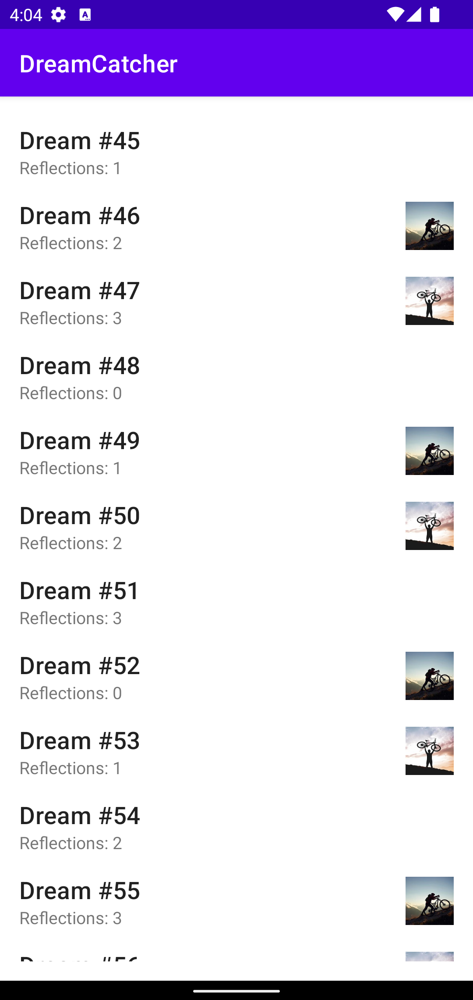
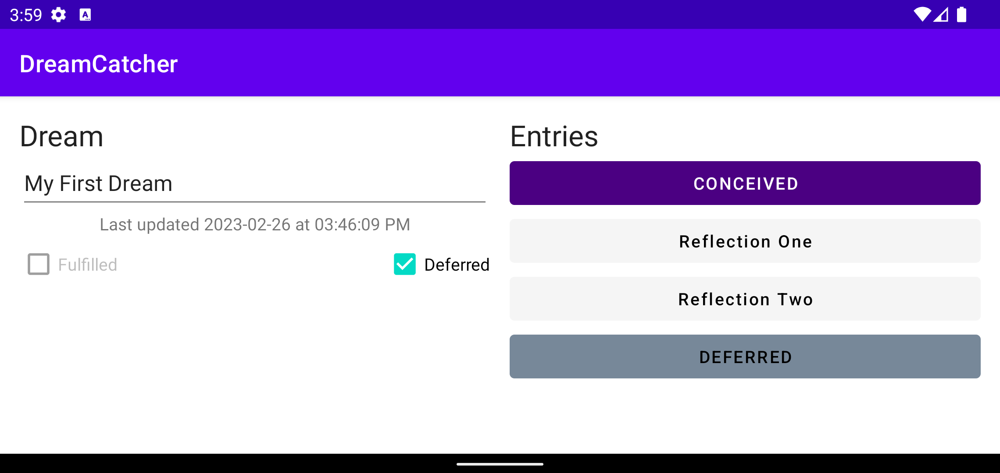

# 💭 DreamCatcher — Part 2A: List & Detail

### The first stage of a Room-backed, fragment-based CRUD app for tracking personal goals and their progress

---

## 🧠 What It Does

DreamCatcher is a goal-tracking app modeled after the classic CriminalIntent list-detail pattern, reimagined around personal "dreams" instead of workplace incidents. Each `Dream` holds a title, a list of `DreamEntry` progress notes, and can be marked as deferred or fulfilled. Part 2A establishes the two core screens as independent fragments — `DreamListFragment`, a scrollable RecyclerView showing all 100 seeded dreams with title, reflection count, and a deferred/fulfilled icon; and `DreamDetailFragment`, showing a single dream's editable title, last-updated timestamp, status checkboxes, and up to five entries rendered as color-coded, disabled buttons.

Both fragments are hosted one at a time by a single `MainActivity`, with no navigation mechanism between them yet — that's intentionally out of scope until Part 2B.

## 🎯 Why It Matters

This is the introduction to Android's Fragment system and the list-detail UI pattern that underlies a huge share of real-world apps — email clients, note-taking apps, contact managers. Building the two screens in isolation first, before wiring in navigation, database persistence, or cross-fragment communication, keeps each concern separable and testable on its own, which is exactly how the two instructor-provided instrumented test suites for this stage are structured.

## ✨ Features

- Scrollable dream list via RecyclerView, showing title, reflection count, and status icon
- Detail screen with editable title, formatted last-updated timestamp, and mutually exclusive Fulfilled/Deferred checkboxes
- Up to five dream entries rendered as color-coded, disabled buttons, with reflection text in mixed case and other entry kinds in their string form
- Checking either status checkbox appends a matching entry and disables the other checkbox; unchecking reverses both effects
- Full portrait and landscape layouts for the detail screen
- 20 instructor-provided instrumented tests across both fragments, all passing

## 🛠️ Requirements

- Android Studio (Electric Eel or later recommended)
- Android SDK Platform 32 (Android 12L)
- Kotlin plugin (bundled with Android Studio)
- An emulator or physical device running API 21+

## ▶️ How to Run

1. Open the project root folder in Android Studio (`File → Open`, select the `P2ADreamCatcher` folder)
2. Let Gradle sync complete
3. Select or create a **Pixel 4 API 32** emulator via **Device Manager**
4. Click **Run ▶️** with the `app` configuration selected

## 🧪 Testing Approach

Verified via the instructor-provided instrumented test suites (`DreamListFragmentTest.kt`, `DreamDetailFragmentTest.kt`), run against the Pixel 4 API 32 emulator — all tests pass. These exercise list rendering and scrolling behavior, and detail-screen field editing, checkbox interaction, and entry-button display, independently of one another since no cross-fragment navigation exists at this stage.

## ✅ Expected Output

The list screen scrolls smoothly through 100 seeded dreams with consistent spacing regardless of whether a status icon is present. The detail screen displays a single placeholder dream with its title, timestamp, status checkboxes, and entries, in both portrait and landscape orientation.

## 💻 Setting This Up on Another PC

1. Clone this repository
2. Open the `P2ADreamCatcher` folder as a project in Android Studio
3. If prompted about Gradle/JDK compatibility, select a **JDK 17** toolchain
4. Sync Gradle, then build and run as described above
5. To run the instrumented test suites: right-click `app/src/androidTest` → **Run Tests** (requires a running emulator or connected device)

## 📝 Notes

The project targets `edu.vt.cs5254.dreamcatcher`. `Dream.kt`, `DreamEntryButtonUtil.kt`, `DreamDetailViewModel.kt`, and `DreamListViewModel.kt` were provided course scaffolding, integrated as-is; `DreamListFragment.kt`, `DreamDetailFragment.kt`, and `DreamListAdapter.kt` contain the fragment and RecyclerView logic described above. At this stage, both fragments use in-memory placeholder data (100 dreams for the list, a single dream for the detail screen); Room-backed persistence is introduced in Part 2B.
