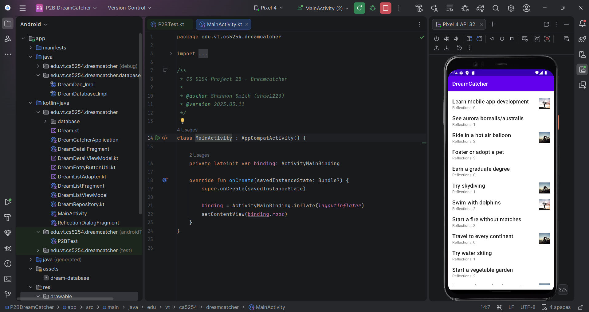

# 💭 DreamCatcher — P2B: Database & Navigation

### Adding Room persistence, Navigation Component wiring, and dialog-based data entry to the list-detail app

---

## 🧠 What It Does

DreamCatcher P2B connects the two fragments built in Part 2A into a working, database-backed app. A **Room** database — seeded from a prepopulated `dream-database` asset with 20 dreams — replaces the in-memory placeholder data from 2A, with a two-table schema (`dream` and `dream_entry`) joined through a `DreamDao` and exposed to the UI as a reactive `Flow` via `DreamRepository`.

Tapping a dream in the list now navigates to its detail screen through a Jetpack **Navigation Component** graph (`nav_graph.xml`), replacing 2A's manual single-fragment hosting. Editing a dream's title or fulfilled/deferred status in the detail screen updates the underlying database immediately, and returning to the list via Back reflects those changes — moving the dream to the top of the list if it changed, leaving it in place otherwise. A new **Reflection dialog**, launched from the detail screen, lets the user append a new reflection entry to any dream that hasn't been marked fulfilled.

## 🎯 Why It Matters

This is where the app becomes real rather than a UI mockup — data now survives process restarts, and the two screens are actually connected the way a finished app's screens would be. It's also the introduction to two patterns used throughout the rest of the DreamCatcher and FancyGallery projects: Room for structured local persistence, and the Navigation Component for fragment-to-fragment transitions with type-safe argument passing — both considerably more representative of production Android development than the single-Activity, no-database approach used in the MultiQuiz series.

## ✨ Features

- Room database with a two-table schema (dreams and their entries), seeded from a seven-dream-per-query join
- Reactive data flow from the database to the UI via Kotlin `Flow`
- List-to-detail navigation via the Jetpack Navigation Component
- Live editing of a dream's title and fulfilled/deferred status, persisted immediately
- Reflection-entry dialog for appending progress notes to any non-fulfilled dream
- Rotation-safe dialog state
- 15 instructor-provided instrumented tests, all passing

## 🛠️ Requirements

- Android Studio (Electric Eel or later recommended)
- Android SDK Platform 32 (Android 12L)
- Kotlin plugin (bundled with Android Studio)
- An emulator or physical device running API 21+

## ▶️ How to Run

1. Open the project root folder in Android Studio (`File → Open`, select the `P2BDreamCatcher` folder)
2. Let Gradle sync complete
3. Select or create a **Pixel 4 API 32** emulator via **Device Manager**
4. Click **Run ▶️** with the `app` configuration selected

## 🧪 Testing Approach

Verified via the instructor-provided instrumented test suite (`P2BTest.kt`), run against the Pixel 4 API 32 emulator — all 15 tests pass. Manual verification additionally confirmed correct list-to-detail navigation with the right dream's data displayed, edits made in the detail screen correctly reflected back in the list (including reordering when a dream is changed), and successful use of the Add Reflection dialog.

## ✅ Expected Output

Tapping any dream in the list opens its detail screen with the correct data. Editing the title or toggling Fulfilled/Deferred and returning via Back shows the change reflected in the list, with the dream moved to the top.

## 💻 Setting This Up on Another PC

1. Clone this repository
2. Open the `P2BDreamCatcher` folder as a project in Android Studio
3. If prompted about Gradle/JDK compatibility, select a **JDK 17** toolchain
4. Sync Gradle, then build and run as described above
5. To run the instrumented test suite: right-click `P2BTest.kt` under `app/src/androidTest` → **Run 'P2BTest'** (requires a running emulator or connected device)

## 📝 Notes

The project targets `edu.vt.cs5254.dreamcatcher`. `Dream.kt`, `DreamEntryButtonUtil.kt`, and the `database/` package's Room infrastructure follow the course's specified schema and query design. `dream-database` in `app/src/main/assets` is the prepopulated seed data described in the course spec and is required for the app to display dreams on first launch.
