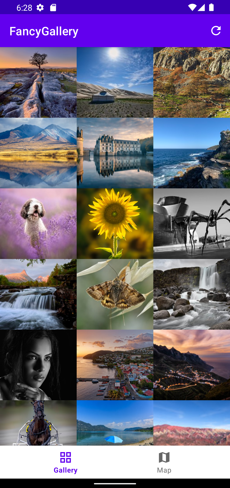
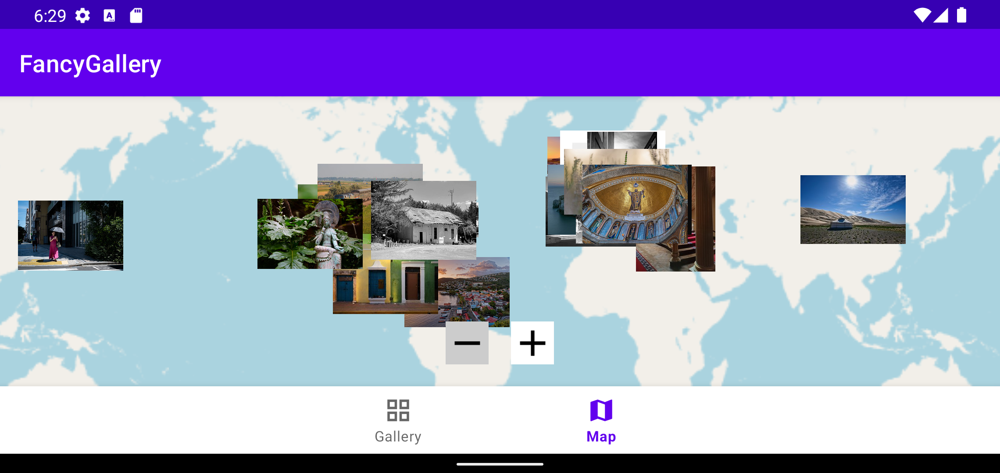

# 🖼️ FancyGallery

### A bottom-navigation app combining a network-backed photo gallery, a WebView browser, and an interactive map with photo markers

---

## 🧠 What It Does

FancyGallery is a two-tab app, switching between a **Gallery** and a **Map** view via bottom navigation. The Gallery tab fetches Flickr's "interestingness" photo feed via Retrofit and Moshi, displaying results in a scrollable grid loaded with Coil, with a Reload menu action to clear the image cache and re-fetch. Tapping a photo opens its Flickr page in a custom in-app browser built on `WebView`, complete with a loading progress bar.

The Map tab renders an OpenStreetMap-based `MapView` (via the OSMDroid library), placing a marker for every photo in the gallery that carries valid geo-coordinates — fetched from a `MainViewModel` shared between both fragments at the Activity scope. Markers display the photo itself as their icon; tapping a marker centers the map on it and shows its title, and tapping again navigates to that photo's detail page.

## 🎯 Why It Matters

This is the capstone project for the course, and the first one to move past the local, self-contained data model of the earlier projects into a fully networked app — fetching live data from a REST API, deserializing JSON into Kotlin objects, loading remote images, and rendering an interactive third-party map component. It also demonstrates cross-fragment data sharing through an Activity-scoped ViewModel (a pattern DreamCatcher didn't need, since it only ever had one screen showing data at a time) to connect two otherwise-independent features — the gallery grid and the map — around the same underlying dataset.

## ✨ Features

- Bottom navigation between Gallery and Map, built without the IDE's Bottom Navigation template
- Live photo feed from Flickr's interestingness API via Retrofit + Moshi, capped to an even 99-photo page size
- Coil-based image loading with a placeholder graphic and cache-clearing Reload action
- In-app WebView browser with a loading progress indicator for viewing a photo's Flickr page
- OSMDroid-based interactive map with pan, zoom, and photo markers at their real-world locations
- Photo markers rendered with the actual photo as the marker icon, centered and raised above overlapping markers on tap
- Shared `MainViewModel` connecting gallery data to the map across both fragments

## 🛠️ Requirements

- Android Studio (Electric Eel or later recommended)
- Android SDK Platform 32 (Android 12L)
- Kotlin plugin (bundled with Android Studio)
- An emulator or physical device running API 24+, with working network access
- A Flickr API key (the app will build and launch without one, but the Gallery tab will not populate with photos)

## ▶️ How to Run

1. Open the project root folder in Android Studio (`File → Open`, select the `P3FancyGallery` folder)
2. Let Gradle sync complete
3. Select or create a **Pixel 4 API 32** emulator via **Device Manager**
4. Click **Run ▶️** with the `app` configuration selected

## 🧪 Testing Approach

Verified via the instructor-provided instrumented test suite (`P3Test.kt`) against the Pixel 4 API 32 emulator, and by manual walkthrough of both tabs — browsing the gallery, reloading the cache, opening a photo's WebView page, and confirming map markers appear at the correct locations and navigate correctly on tap. One test exercising in-app WebView page-load completion is network- and emulator-dependent; the assignment specification itself documents a known Chrome/WebView rendering issue on API 31/32 emulators, along with an optional `advancedFeatures.ini` workaround.

## ✅ Expected Output

The Gallery tab fills the grid with 99 photos across 33 even rows. The Map tab shows photo markers scattered across their real-world locations; tapping a marker centers the map and shows its title, and tapping it again opens the photo's detail page.

## 💻 Setting This Up on Another PC

1. Clone this repository
2. Open the `P3FancyGallery` folder as a project in Android Studio
3. If prompted about Gradle/JDK compatibility, select a **JDK 17** toolchain
4. Provide a valid Flickr API key (see Flickr's developer portal for a free key) for the Gallery tab to display photos
5. Sync Gradle, then build and run as described above
6. To run the instrumented test suite: right-click `P3Test.kt` under `app/src/androidTest` → **Run 'P3Test'** (requires a running emulator or connected device with network access)

## 📝 Notes

The project targets `edu.vt.cs5254.fancygallery`. Project- and module-level `build.gradle` files were provided by the course to account for dependency and plugin updates since the original textbook was published, and were used largely as-is. `PictureUtils`-style image loading is handled through Coil rather than manual bitmap decoding.
