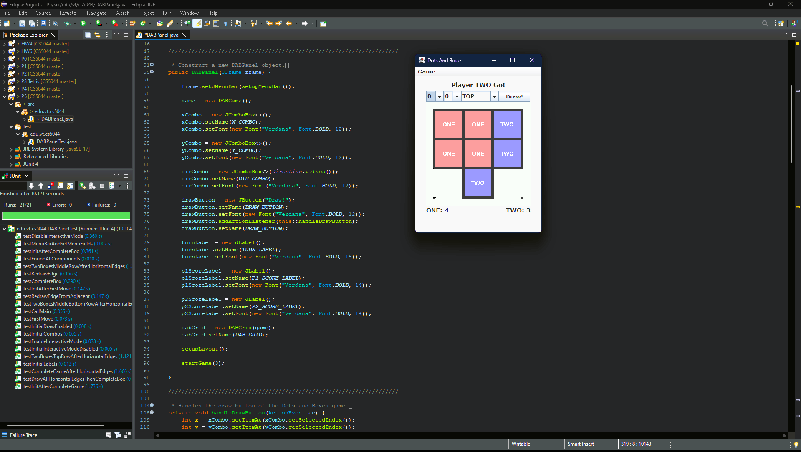
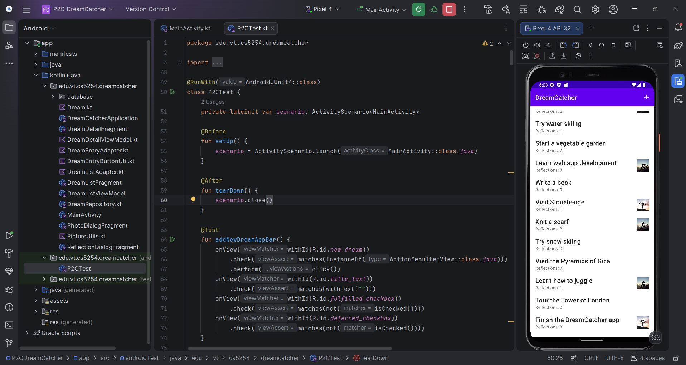
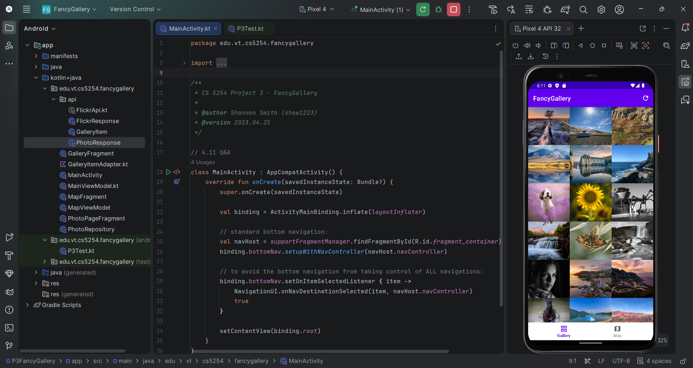

# VT Projects 2021–2023

## Coursework from Virginia Tech's Master of Information Technology program

---

## 🧠 What This Is

A collection of the coursework projects from five courses across my Master of Information
Technology program at Virginia Tech, spanning object-oriented Java, full-stack web
development, Android mobile development, graduate-level software engineering, and applied
cybersecurity. Each course folder is its own self-contained project series with its own
detailed README - this page is the index tying them together.

The courses weren't taken in a single deliberate arc toward security, but read
chronologically they form one anyway: a deep grounding in object-oriented design and
testing discipline (CS 5044), applied at increasing scale across a full-stack web
application (CS 5244) and a native mobile app (CS 5254), formalized into structural
software-engineering practice (CS 5704), and finally turned outward into applied
offensive/defensive security work (ECE 5480) - which is where the rest of my post-grad
work, including my SOC-focused home lab and GitHub portfolio, actually picks up.

---

## 📂 Course Index

---

### ☕ [CS 5044 — Object-Oriented Programming with Java](./CS5044)

Six projects tracing a progression from basic Java syntax through object-oriented design,
algorithmic AI, data structure delegation, and GUI integration - from an ASCII-art "Hello
World" through a heuristic-driven Tetris AI, a fully branch-covered Dots and Boxes game
engine, and a Swing GUI wired on top of that tested engine.

**Highlights:** JUnit-verified full branch coverage including every exception path;
a Tetris AI tuned against a numeric benchmark rather than a single expected output; a
constrained-control-flow minivan door state machine built with no nested branches or
boolean operators.

 

*The heuristic-driven Tetris AI (P3) · The Dots and Boxes Swing GUI wired on top of the fully-tested P4 engine (P5)*

---

### 📚 [CS 5244 — Web Application Development](./CS5244)

A full-stack online bookstore, "Shae's Books," built in ten staged projects - from Figma
wireframes through static HTML, a Vue 3 SPA, a Java DAO/REST API, centralized Pinia state,
a persisted shopping cart, client- and server-side validated checkout, and real
multi-table database transactions with a hardened, navigation-resilient front end.

**Highlights:** Server-side validation that independently re-checks every field and cart
item rather than trusting the client; credit card numbers truncated to the last 4 digits
at the server's data model level, so the full number never leaves the server in an API
response; a real JDBC transaction across three related tables with manual commit/rollback.

 

*Live category browsing backed by a real database (P6) · A completed, real database transaction landing on a live confirmation page (P10)*

---

### 📱 [CS 5254 — Mobile Application Development](./CS5254)

Eight Android Studio projects following the *Big Nerd Ranch Guide*, progressing from a
single `Activity` with view binding through Fragment-based navigation, Room-backed
persistence, and a fully networked, map-integrated app - a true/false geography quiz, a
multi-question quiz with `ViewModel`-backed rotation safety, a full-CRUD "dream journal"
app with camera and sharing support, and a two-tab photo gallery pulling live data from
Flickr's API onto an interactive map.

**Highlights:** A Room-backed app supporting swipe-to-delete, implicit-intent sharing, and
`FileProvider`-safe camera photo attachment; a Retrofit/Moshi-powered gallery and OSMDroid
map sharing one Activity-scoped `ViewModel` around a single live dataset.

 

*DreamCatcher's full-CRUD dream journal with camera attachment (P2C) · FancyGallery's live Flickr feed on an interactive OSMDroid map (P3)*

---

### 🧱 [CS 5704 — Software Engineering](./CS5704)

Four graduate-level projects spanning bounded data structure design, legacy code
refactoring into a generalized multi-variant engine, and a full Kotlin/Swing
implementation of six classic design patterns - two verified-interchangeable custom
collection implementations, a river-crossing puzzle refactored to support three variants
behind one shared engine interface, and an interactive duck pond simulator demonstrating
Strategy, Decorator, Factory/Singleton, Adapter, Observer, and Composite live in the GUI.

**Highlights:** A GUI with zero hardcoded knowledge of which puzzle variant is running -
adding a second and third game variant required no GUI changes at all, which was the
actual point of the refactor.

 

*The generalized river-crossing engine running its monster/munchkin variant (P2) · DuckSim's interactive pond, demonstrating six design patterns live (P3)*

---

### 🔐 [ECE 5480 — Cybersecurity and the Internet of Things](./ECE5480)

Six projects split between security automation scripting and hands-on offensive lab
exercises: Python-based reconnaissance and web-content automation, MD5 rainbow table
password recovery, large-scale DNS log triage, and three escalating SEED Labs exercises -
CSRF, a self-propagating XSS worm modeled on the 2005 Samy worm, and DNS response
spoofing escalating to full-domain nameserver hijacking.

**Highlights:** A rainbow table demonstrating the precompute-once/crack-forever tradeoff
(and why it fails against salted hashes); a DNS log analysis script processing tens of
thousands of real query records to surface the kind of volume anomaly that flags C2
beaconing or tunneling in real SOC triage.

 

*DNS log analysis surfacing top clients/domains across tens of thousands of records (P3) · The self-propagating XSS worm live in the SEED Labs Elgg environment (P5)*

---

## 🧠 How the Five Courses Connect

| Course | Domain | What It Builds Toward |
|---|---|---|
| CS 5044 | Object-oriented Java, testing discipline | The design/testing foundation every later project assumes |
| CS 5244 | Full-stack web development | Real client/server architecture, REST APIs, defense-in-depth validation |
| CS 5254 | Native mobile development | Platform-integrated apps: local persistence, networking, device APIs |
| CS 5704 | Graduate software engineering | Interface-driven design, refactoring, and named design patterns |
| ECE 5480 | Applied cybersecurity | Turns the same engineering skill set outward into offensive/defensive security work |

---

## 🛠️ Tech Stack Overview

| Domain | Technologies |
|---|---|
| Languages | Java, Kotlin, TypeScript, Python |
| Web | Vue 3, Vite, Pinia, Vuelidate, Jakarta EE, Jersey (JAX-RS) |
| Mobile | Android Studio, Jetpack (ViewModel, Navigation, Room), Retrofit, Moshi, Coil, OSMDroid |
| Data | MySQL 8 (raw JDBC), Room |
| Testing | JUnit 4, Espresso |
| Security tooling | Scapy, `hashlib`, `requests`/`BeautifulSoup`, SEED Labs (Docker/VirtualBox) |
| Build tools | Gradle |

---

## 📄 A Note on Scope

Each course folder above is a self-contained coursework series, developed for grading
requirements and academic deadlines rather than as production software - readers should
weigh that context accordingly. Every folder's own README documents what was actually
built, why, and (for the web application series especially) what real environment and
deployment troubleshooting was involved in getting a multi-year-old project running again.

---

## 👤 Shannon Smith

Cybersecurity | SOC Operations • Detection Engineering • Incident Response

